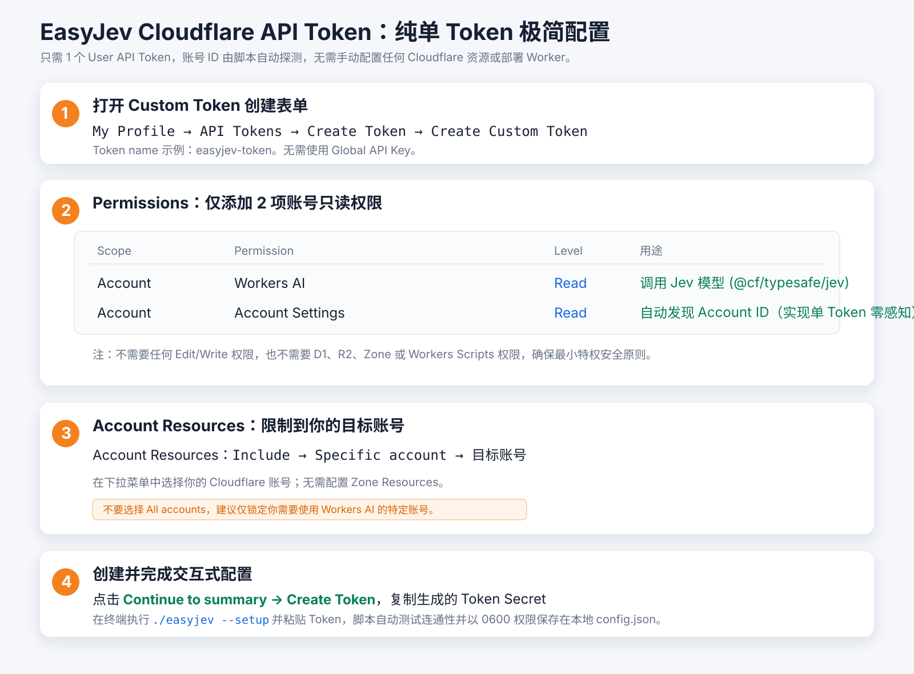

# EasyJev

当前版本：`0.1.1`

[EasyJev Latest 下载](https://github.com/chenpey/easy_suite/releases/tag/easyjev-v0.1.1)

EasyJev 是为 **Codex** 与 **Antigravity** 打造的极简 **Cloudflare Workers AI Jev 决策门禁** 集成工具。

通过标准 MCP (Model Context Protocol) 协议，将 Cloudflare 托管的 TypeSafe Jev（`@cf/typesafe/jev`）作为快速、高确定性的“系统一”（System One）决策工具提供给 AI 编码助手，在代码门禁、安全审查、数据分类打标和上下文初筛等高频判断场景下，大幅降低主模型的 Token 消耗与响应延迟。

---

## 特性亮点

* **极简单文件**：单文件自执行脚本，**0 第三方依赖**（无需 `npm install`），拉取即用。
* **纯单 Token 模式**：只需提供 1 个 Cloudflare API Token，Account ID 启动时自动探测，用户与本地配置**完全零感知 Account ID**。
* **安全本地存储**：交互式隐藏输入（无明文回显），Token 保存于本地 `config.json`，权限强制锁定为 `0600`（仅当前用户可读写），已写入 `.gitignore`。
* **免费额度直连**：直接通过 REST API 调用 Cloudflare Workers AI 每日免费 Neurons 额度，**无需在 Cloudflare 上部署任何 Worker**。
* **原生 MCP 支持**：无缝对接 Codex CLI、Codex Desktop 与 Antigravity。

---

## 准备：获取 Cloudflare API Token

EasyJev 全程仅需 1 个 **Cloudflare User API Token**，权限为严格受限的只读最小权限。

### 1. 最小权限表

| Scope | Permission | Level | 用途 |
| :--- | :--- | :--- | :--- |
| **Account** | **Workers AI** | **Read** | 调用 Jev 模型（`@cf/typesafe/jev`）推理接口 |
| **Account** | **Account Settings** | **Read** | 自动发现关联 Account ID，实现单 Token 零感知配置 |

### 2. 创建步骤

1. 打开 [Cloudflare Dashboard → My Profile → API Tokens](https://dash.cloudflare.com/profile/api-tokens/)。
2. 选择 **Create Token → Create Custom Token**。
3. Token name 填写 `easyjev-token`。
4. 在 **Permissions** 添加上述两项只读权限。
5. 在 **Account Resources** 选择 **Include → Specific account → 你的目标账号**。
6. 点击 **Continue to summary** 核对，然后点击 **Create Token**，复制生成的 Token Secret。



---

## 快速配置

### 方式 1：直接下载 Release 单文件（最简，推荐）

无需克隆整个仓库，直接从 [EasyJev Latest](https://github.com/chenpey/easy_suite/releases/tag/easyjev-v0.1.1) 下载 `easyjev` 可执行单文件：

```bash
# 赋予执行权限
chmod +x easyjev

# 运行交互式引导
./easyjev --setup
```

### 方式 2：克隆仓库使用

```bash
cd easyjev
./easyjev --setup
```

引导流程：
1. 终端提示 `Cloudflare API Token (hidden): `，粘贴 Token（终端静默输入无回显）。
2. 脚本自动校验 Token、探测关联账号并向 `@cf/typesafe/jev` 发送测试推理。
3. 验证成功后，自动写入本地 `config.json`（权限自动设为 `0600`）。
4. 若本机已安装 `codex` CLI，脚本将**自动执行注册**；亦可随时手动完成接入。

测试连通性：
```bash
./easyjev test
```

---

## Codex 与 Antigravity 接入

### 1. 接入 Codex

#### 命令行一键接入（推荐）
在任意终端执行：
```bash
codex mcp add easyjev -- /Users/chenpei/MEGA/workspace/easy_suite/easyjev/easyjev
```

#### 配置文件手动接入
在 `~/.codex/config.toml` 中添加：
```toml
[mcp_servers.easyjev]
command = "/Users/chenpei/MEGA/workspace/easy_suite/easyjev/easyjev"
```
*(注意：命令直接指向可执行文件 `easyjev`，配置中不需要写 `node`，也无需放置任何 Token 密文。)*

### 2. 接入 Antigravity

在 Antigravity 的 MCP 配置文件（`mcp_config.json`）中添加：

```json
{
  "mcpServers": {
    "easyjev": {
      "command": "/Users/chenpei/MEGA/workspace/easy_suite/easyjev/easyjev"
    }
  }
}
```

---

## 使用方法与 Prompt 提示词范例

AI（Codex / Antigravity）启动后会自动挂载 `easyjev` 提供的 MCP 工具。你在聊天对话中**无需手动执行脚本，直接使用自然语言向 AI 提要求即可**，AI 会自主决定在后台调用相应工具。

### 提供的核心工具

1. **`jev_eval`（结构化快思考裁决）**：
   * 输入上下文与问题清单（支持 `noul` 布尔判断、`choice` 分类选项、`score` 评分），输出精确裁决与置信度（Confidence）。
2. **`jev_label`（文本/数据分类打标）**：
   * 将文本或记录归类到指定的一组标签中。
3. **`jev_relevance`（目标相关性初筛）**：
   * 对一组候选代码片段或文本针对目标进行相关度评估，过滤无关噪声。

---

### 场景 1：代码安全与风险门禁（`jev_eval`）

在执行敏感操作、重构或提交代码前，让 Codex 先由 Jev 进行快速门禁评估：

> **给 Codex 的提示词**：  
> “帮我审查刚才修改的 `db/migration.sql` 脚本，调用 `jev_eval` 判断是否存在高危或不可逆破坏性操作（如 DROP TABLE、TRUNCATE），并评估风险等级。”

**AI 动作**：
* Codex 自动调用 `jev_eval`，把 SQL 内容传给 Jev；
* Jev 在 150ms 内返回结构化判断结果与置信度；
* Codex 根据 Jev 的裁决给出详细的安全说明或拦截警告。

---

### 场景 2：数据/工单/反馈批量打标（`jev_label`）

对多条用户反馈、报错日志或工单做快速分流：

> **给 Codex 的提示词**：  
> “读取 `feedback.jsonl` 中的所有反馈内容，使用 `jev_label` 工具为每条内容打上 [bug, feature_request, performance, billing] 中的一个标签，并将打标结果写入 `feedback_labeled.jsonl`。”

**AI 动作**：
* Codex 逐条或分批调用 `jev_label`，快速完成标签归属，显著降低大模型逐条生成的耗时与费用。

---

### 场景 3：大文件上下文初筛（`jev_relevance`）

当项目中代码量很大，想先初筛出真正相关的代码片段，避免主模型上下文爆炸：

> **给 Codex / Antigravity 的提示词**：  
> “我准备为项目增加 OAuth2 登录功能。请在当前仓库中检索候选模块，并使用 `jev_relevance` 帮我挑选出与认证系统最相关的 3 个代码文件。”

**AI 动作**：
* AI 搜索出潜在候选后，调用 `jev_relevance` 做快速二值判断与打分；
* 筛除无关文件，仅将真正关键的代码读入主上下文进行深入编写。

---

## 常见问题与排查

* **Q: 提示 `Configuration missing`？**
  * 请先在 `easyjev` 目录下运行 `./easyjev --setup` 完成一次性配置。
* **Q: 遇到 403 Forbidden 错误？**
  * 检查 Cloudflare API Token 是否赋予了 `Workers AI: Read` 与 `Account Settings: Read`。
* **Q: Token 保存在哪里？安全吗？**
  * 保存在本地 `easyjev/config.json`，权限为 `0600`（同机其他用户无法读取），且已被 `.gitignore` 忽略，绝不会随 Git 提交。Codex 配置文件中无任何 Secret。
