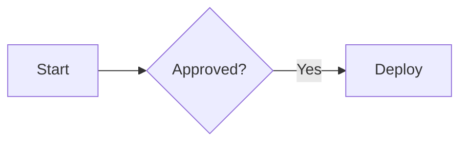

# EasyNote

[简体中文](README.md) | [English](README.en.md)

Current Version: `0.8.5`

A self-hosted Markdown note-taking application for individuals or small teams. React + TypeScript frontend, pdfmake PDF generation with PDF.js paginated preview, Cloudflare Worker API, D1 database for accounts and notes, and private R2 object storage for images and attachments.

## Implemented Features

- Multi-tenant model: Initial admin provisioning, user management, approval-based registration (disabled by default), recovery codes, account deletion, HttpOnly session cookies, CSRF, origin checks, and login rate limiting. Notes, versions, attachments, offline caches, and AI tokens are strictly tenant-isolated.
- Note creation, standalone title, Markdown editing/preview, checkable tasks, autosave, pinning in the note list, archive, tags, and full-text keyword search.
- Task Center: Aggregates incomplete Markdown TODOs with source note and line number references, with direct jump-to-source support.
- Single blank note rule: Keeps at most one completely blank note per account; creating a new note reuses an existing blank note if present.
- CodeMirror 6 editor, markdown-it parsing with DOMPurify sanitization, supporting footnotes, code highlighting, and safe HTML blocks.
- Mermaid diagrams: Flowcharts, mindmaps, and other Mermaid charts rendered on-demand in preview mode.
- Image pasting, drag-and-drop, and file selection (JPEG, PNG, WebP); private attachments (PDF, Markdown, TXT, CSV, JSON); inserted at cursor position.
- PDF export with authentic paginated preview, A4/Letter formats, portrait/landscape orientation, and scaling; direct download on desktop, system share sheet on iOS/Android.
- Trash bin, restore, permanent deletion, and tombstone records preventing stale devices from resurrecting purged notes.
- Revision-based concurrency control, 3-way merge from base revisions, manual conflict resolution with conflict copies, idempotent retries, manual snapshot history, and version restore.
- Full offline note library (enabled by default): IndexedDB mirrors note content, private files, full-text search, and pending drafts, automatically submitting changes upon reconnecting.
- Durable Object WebSockets broadcast mutation signals (create, update, delete) per account; clients fetch authoritative data upon notification. Foreground polling and focus restoration act as fallbacks.
- Installable PWA with a standalone app window, home screen icon, app shell caching, and offline cold start. Notes can open in a regular separate reader window; system-level always-on-top is not supported.
- Searchable command palette (`Cmd/Ctrl+K`), document outline, stable internal links (`[[UUID|Title]]`), and backlinks.
- Tag renaming, merging, deletion, plus batch archive and tagging.
- AI read/write integration: Restricted tokens, exact note statistics, cross-status FTS5 relevance search, match character ranges, batch reading, MCP Resources, and writing tools. AI edits enter version history.
- Desktop/mobile layouts, light/dark themes, ZIP export/recovery, and import support for Obsidian directories, Markdown/TXT ZIPs, and individual files.
- Revocable time-limited or permanent read-only share links with centralized management.
- Scheduled cleanup of expired sessions, share links, login counters, unreferenced files, failed uploads, and deleted tenant data.

## Project Structure

```text
easynote/
├── src/
│   ├── client/
│   │   ├── App.tsx            # Login, workspace, settings, and dialogs
│   │   ├── Editor.tsx         # CodeMirror and sanitized Markdown preview
│   │   ├── useNotebook.ts     # Autosave, revision conflicts, list, polling
│   │   ├── merge.ts           # 3-way merge and conflict detection
│   │   ├── drafts.ts          # IndexedDB drafts, offline mirror, private files
│   │   ├── api.ts             # API client, error handling, private file uploads
│   │   ├── pdf.ts             # Structured PDF generation and paginated preview
│   │   ├── transfer.ts        # ZIP export, validation, remapping, import
│   │   ├── UserManagement.tsx  # Admin user and registration management
│   │   ├── NoteSharing.tsx     # Single-note read-only sharing
│   │   ├── ShareManagement.tsx # Share list, renewal, and revocation
│   │   ├── styles.css
│   │   └── main.tsx
│   ├── worker/
│   │   ├── index.ts           # Request routing and Cron triggers
│   │   ├── auth.ts            # Multi-user, sessions, recovery, admin, rate limits
│   │   ├── events.ts          # Durable Object WebSocket mutation notifications
│   │   ├── features.ts        # Task center and read-only sharing
│   │   ├── integrations.ts    # AI tokens, snapshots, delta sync, controlled writes
│   │   ├── notes.ts           # Notes, tags, versions, soft delete, purging
│   │   ├── images.ts          # Private files, quota reservation, cleanup
│   │   └── core.ts            # Config validation, limits, errors, shared types
│   ├── ai/
│   │   ├── index.ts           # Remote MCP tools and Resources
│   │   └── client.ts          # MCP internal API client
│   └── shared/types.ts
├── docs/AI_INTEGRATION.md     # User and AI integration guide
├── docs/DISASTER_RECOVERY.md  # Backup and disaster recovery procedures
├── migrations/                # D1 schema baseline
├── scripts/                   # Setup, maintenance, Cloudflare API, deployment
├── test/                      # Integration and UI tests
├── setup.sh                  # Prepare local dependencies and admin
├── dev.sh                    # One-command local development server
├── deploy.sh                 # Interactive production deployment
├── backup.sh                 # Interactive D1/R2 disaster recovery backup
├── restore.sh                # Backup verification and restore
├── reset-password.sh         # Interactive password recovery
├── wrangler.json             # Worker config, bindings, and environment variables
├── vite.config.ts
└── playwright.config.ts
```

## Local Development

Requires Node.js 22.12 or later and Bash (macOS / Linux).

```bash
cd easynote
bash dev.sh
```

First launch automatically installs dependencies and interactively prompts for initial admin credentials, builds the frontend, applies D1 migrations, and starts the service. Access at `http://127.0.0.1:8791`.

| Command | Description |
| --- | --- |
| `bash setup.sh` | Install dependencies and initialize admin without starting the server |
| `bash dev.sh` | Start local development server (auto-initializes if unconfigured) |
| `bash dev.sh --port 8793` | Start on custom port |
| `bash deploy.sh` | Interactive production deployment |
| `bash deploy.sh --check` | Local build and Wrangler preflight checks |
| `bash reset-password.sh --local` | Reset local account password |
| `bash reset-password.sh --remote` | Reset remote account password |
| `bash ../reset.sh easynote --local` | Clear local D1/R2 state while preserving admin config |
| `bash ../reset.sh easynote --remote` | Reset remote Cloudflare D1/R2 and Worker |
| `bash backup.sh --remote` | Create and verify full D1/R2 disaster recovery backup |
| `bash restore.sh <dir> --remote --check` | Preflight check for backup restoration |
| `bash restore.sh <dir> --remote` | Restore backup to empty D1/R2 resources |
| `npm run test:ai` | Test remote Streamable HTTP MCP integration |

### Version Management

Versions are maintained in [`versions.json`](../versions.json) at the repository root:

```bash
node scripts/version.mjs bump easynote patch
node scripts/version.mjs check
git add .
git commit -m "发布：EasyNote v0.4.4"
```

## Production Deployment

### 1. Enable R2

When using R2 for the first time, log into [Cloudflare Dashboard](https://dash.cloudflare.com/), go to **Storage & databases → R2 → Overview**, and complete the R2 subscription checkout. Once the **Create bucket** button appears, return to your terminal; manual bucket creation is not required.


The deployment script automatically discovers accounts based on your Token, creates or reuses dedicated `easynote-db` and private `easynote-images`, and retrieves the D1 UUID.

### 2. Choose Public Access

- Leave blank for `workers.dev` (creates an account-level subdomain if absent).
- Enter a custom domain (e.g. `notes.example.com`), which must belong to an Active Zone in the same account.

### 3. Create Custom API Token

Create a Custom API Token under [My Profile → API Tokens](https://dash.cloudflare.com/profile/api-tokens/):

- Account Settings: Read (to discover accounts)
- Workers Scripts: Edit (to create/update Worker, assets, and secrets)
- D1: Edit (to manage database and migrations)
- Workers R2 Storage: Edit (to manage private R2 bucket)
- (Custom Domain only) Zone: Read
- (Custom Domain only) Workers Routes: Read


### 4. Deploy

```bash
bash deploy.sh
```

Follow the prompts to enter your API Token, select or confirm resources, and finalize deployment.

## Key Behaviors

### Autosave & Conflicts

Autosave updates note content with `createVersion: false`. Explicit saves (`Cmd/Ctrl+S` or "Sync and Update Version") set `createVersion: true` to snapshot history. AI writes enforce version creation. Duplicate content does not create redundant history snapshots.

Simultaneous edits on different devices are resolved using revision numbers. Conflicts return `409 Conflict`, preserving local drafts and allowing users to branch into conflict copies without overwriting remote data.

### Shortcuts & Navigation

`Cmd/Ctrl+K` opens the quick command palette for navigation, actions, search, and settings.

| Shortcut | Action |
| --- | --- |
| `Cmd/Ctrl+S` | Save, sync, and record version snapshot |
| `Ctrl+E` / `Cmd/Ctrl+Enter` | Toggle edit and preview mode (retains cursor position) |
| `Cmd/Ctrl+B` / `Cmd/Ctrl+I` | Toggle bold / italic in editor |
| `Cmd/Ctrl+P` | Export current note as PDF |
| `Cmd/Ctrl+/` | View keyboard shortcuts |
| `Esc` | Close dialogs |

Double-clicking any heading, paragraph, list item, table, or code block in preview mode instantly switches to edit mode and jumps to the exact source line in the editor.

### Heading Hierarchy & Outline

EasyNote provides a dedicated note title input; titles do not require Markdown `#` prefixes. The note body starts major sections with `##`, subsections with `###`, and so forth. The sidebar outline panel automatically generates a hierarchical table of contents from body headings for quick jumping.

### Interactive Task Lists

Use `- [ ] task` for incomplete items and `- [x] task` for completed items (`- [] task` shorthand is also supported). In preview mode, checkboxes can be directly clicked to toggle status, which automatically writes back to the Markdown source and saves.

```markdown
- [ ] Incomplete task
- [x] Completed task
```

The sidebar "Task Center" aggregates all uncompleted tasks across all non-deleted notes (including archived notes), while ignoring task syntax inside code blocks. Each entry displays its source note and line number, and clicking it jumps directly to that line in edit mode.

### GFM Tables

Supports standard GitHub Flavored Markdown tables with column alignment via colons:

```markdown
| Header 1 | Header 2 | Header 3 |
| :--- | :---: | ---: |
| Left-aligned | Center-aligned | Right-aligned |
```

Double-clicking a table in preview mode jumps to its Markdown source line. Tables automatically adapt to desktop and mobile viewport widths.

### Code Blocks & Syntax Highlighting

Code blocks use fenced syntax with language tags (powered by `highlight.js/lib/common`), supporting major languages such as `typescript`, `javascript`, `python`, `bash`, `json`, `html`, `css`, `yaml`, `sql`, `go`, etc. Unrecognized languages gracefully fall back to safe plain text. Double-clicking any code block navigates to its editor source line.

````markdown
```python
def hello_world():
    print("Hello from EasyNote")
```
````

### Footnotes

Supports standard Markdown footnote syntax:

```markdown
Body reference[^1] and additional note[^details].

[^1]: Detailed definition for the first footnote.
[^details]: Footnote content supports multi-line text and links.
```

In preview mode, clicking a superscript (e.g. `[1]`) smoothly scrolls down to the footnote definition at the bottom; clicking the backreference link (`↩︎`) smoothly returns to the citation in the body text.

### Knowledge Links (WikiLinks) & Backlinks

Use `[[Note UUID|Display Title]]` or `[[Note UUID]]` to build bidirectional links between notes. Links are permanently bound to the note's UUID, so renaming a target note's title will not break existing links. Clicking a link in preview mode directly navigates to the target note in-app.

```markdown
See reference document: [[00000000-0000-0000-0000-000000000001|Project Specification]]
```

The sidebar outline panel scans active notes in real time to display "Backlinks" (all notes referencing the current note), establishing a two-way knowledge graph.

### Diagrams & HTML

Flowcharts and mindmaps use Mermaid fenced code blocks and render automatically in preview mode, with full light/dark mode auto-theming:

````markdown

````

For mindmaps, set the first line to `mindmap` and indent child nodes. Common diagram types such as `sequenceDiagram`, `classDiagram`, and `stateDiagram` are also supported. Notes support up to 20 Mermaid diagrams, each up to 50,000 characters.

Safe HTML blocks can be embedded directly in Markdown, sanitized via DOMPurify. Safe structural tags like `<section>`, `<mark>`, `<kbd>`, `<details>`, `<summary>` are preserved; risky elements such as `<script>`, `<style>`, `<iframe>`, `<form>`, inline event handlers, and external media are stripped.

You can import [`examples/markdown-syntax-demo.en.md`](examples/markdown-syntax-demo.en.md) to test the complete rendering syntax showcase, or [`examples/mermaid-html-demo.md`](examples/mermaid-html-demo.md) for diagrams and HTML blocks.

### Images & Attachments

- **Private Image Syntax**: ``. Supports original image uploads (no lossy compression or EXIF stripping), lazy loading, offline IndexedDB cache fallback, and full-screen lightbox zoom upon clicking in preview mode.
- **Private Attachment Syntax**: `[Document.pdf](/api/files/<uuid>)`. For PDF, TXT, CSV, JSON, ZIP, etc., clicking the link in preview mode triggers a secure browser download with the `download` attribute and `nosniff` security header.
- **External Image Tracking Shield**: To prevent access tracking and privacy leaks, external HTTP(S) images are blocked by default and rendered with a placeholder (`[外部图片未加载]`).
- **Security & Storage**:
  - Image/attachment URLs use stable internal routes (`/api/images/<id>`), with no public buckets or temporary signed URLs.
  - Every file request verifies login and tenant ownership with `private, no-store` headers.
  - Files referenced by active notes, trash, or retained version snapshots are protected from deletion; unreferenced files are safely cleaned up after a grace period.

### AI Integration (MCP)

EasyNote supports Model Context Protocol (MCP) natively:

1. Generate a token under "Settings → AI Integration" in the web app.
2. Connect your AI client (e.g. Codex) to `https://your-domain/mcp` using Bearer authentication.
3. AI agents gain permission-scoped access to search, read, create, or modify notes through standard MCP tools and resources. See [`docs/AI_INTEGRATION.en.md`](docs/AI_INTEGRATION.en.md) for full details.

## Configuration

Configured in `wrangler.json` under `vars`:

| Key | Default | Description |
| --- | --- | --- |
| `MAX_NOTE_BYTES` | 262144 | Maximum note body size (256 KiB) |
| `MAX_IMAGE_BYTES` | 8388608 | Maximum image size (8 MiB) |
| `MAX_IMAGE_PIXELS` | 40000000 | Maximum image pixels (40 MP) |
| `MAX_ATTACHMENT_BYTES` | 20971520 | Maximum attachment size (20 MiB) |
| `IMAGE_QUOTA_BYTES` | 1073741824 | Per-user R2 file quota (1 GiB) |
| `MAX_NOTES` | 5000 | Maximum notes per user (including trash) |
| `VERSIONS_KEPT` | 20 | Maximum historical snapshots per note |
| `IMAGE_GRACE_HOURS` | 168 | Retention grace period for unreferenced files |
| `SESSION_DAYS` | 30 | Session expiration duration in days |
| `AUTOSAVE_MS` | 1000 | Autosave delay after typing stops |
| `POLL_SECONDS` | 30 | Foreground sync polling fallback interval |
| `LOGIN_WINDOW_SECONDS` | 900 | Login attempt rate limit window |
| `LOGIN_IP_LIMIT` | 20 | Login attempts per IP within window |
| `LOGIN_GLOBAL_LIMIT` | 200 | Global login attempts within window |

## Verification

```bash
bash deploy.sh --check
npm run build
npm test
npm run test:ai
npm run test:scripts
npx playwright install chromium
npm run test:ui
```
