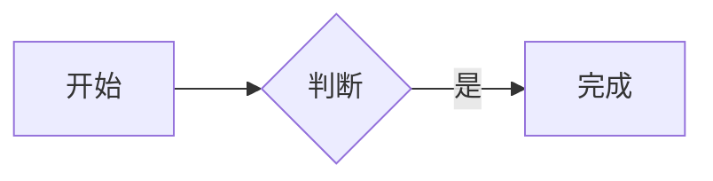

# EasyNote

当前版本：`0.4.0`

一个面向个人或小团队的自托管 Markdown 笔记应用。React + TypeScript 前端，pdfmake 生成 PDF、PDF.js 分页预览，Cloudflare Worker API，D1 保存账号与笔记，私有 R2 保存图片与附件。

## 0.3.2 更新

- 优化首次打开与刷新：并行读取本地离线会话和验证服务器会话，有有效缓存时先显示本地笔记；验证后自动恢复同步，过期或切换账号时清理旧账号缓存。
- 精简会话接口：有效会话跳过账号初始化检查，会话验证与注册开关查询并行执行，保留首次安装的初始化行为。
- 笔记列表不再等待附件缓存：先展示已有本地笔记，文本同步完成后更新列表；图片与附件后台缓存，单次下载 30 秒超时，失败后续重试，关闭离线库或离开账号时取消下载；PDF 离线资源会在 Service Worker 接管页面后预热，避免首次启用时漏缓存。

## 0.3.1 更新

- 统一弹窗反馈层级：弹窗操作产生的成功提示和错误信息直接显示在当前弹窗顶部，不再被遮罩或底部操作区覆盖；无弹窗时继续使用全局提示。
- 覆盖分享、标签、账号、安全设置和其他复用弹窗，并验证桌面端与 320px 移动端布局。

## 已实现

- 多用户租户模型：初始化管理员、管理员用户管理、默认关闭的审批式注册、恢复代码、账号删除、HttpOnly 会话 Cookie、CSRF、来源检查与登录限流；笔记、版本、附件、离线缓存和 AI 令牌均按用户隔离。
- 笔记新建、独立标题、Markdown 编辑/预览、可勾选待办事项、自动保存、置顶、归档、标签和中文关键词搜索。
- 任务中心聚合所有未完成 Markdown TODO，显示来源笔记和行号，并可直接跳回源码位置。
- 同一账号最多保留一篇完全空白的正常笔记；再次新建时直接打开已有空白笔记。
- CodeMirror 6 编辑器，markdown-it 解析和 DOMPurify 清理，支持脚注、代码高亮和安全 HTML block。
- Mermaid 流程图、脑图及其他 Mermaid 图表在预览模式按需渲染。
- JPEG / PNG / WebP 图片选择、粘贴、拖入；PDF、Markdown、TXT、CSV、JSON 私有附件；文件按光标位置插入。
- PDF 导出支持真实逐页预览、A4/Letter、横竖方向和缩放；桌面端下载，iOS/Android 使用系统分享。
- 回收站、恢复、单篇或全部永久删除，以及防止旧设备重建已清除笔记的墓碑记录；永久删除均需二次确认。
- 修订号并发保护、基于编辑起点的三方合并、重叠冲突人工选择与冲突副本、幂等重试、手动保存历史、AI 写入历史和版本恢复。
- 默认开启的完整离线笔记库：IndexedDB 镜像正文、私有文件、全文搜索和待同步草稿，恢复联网后自动提交。
- 按账号隔离的 Durable Object WebSocket 实时通知新增、更新和删除，客户端收到通知后拉取权威数据；前台轮询、切回页面和恢复联网继续作为断线兜底。
- 可安装 PWA，提供独立窗口、桌面/主屏幕图标、应用外壳离线缓存和离线冷启动。
- 常用键盘操作、可搜索命令面板、大纲、稳定内部链接和反向链接。
- 标签重命名、合并、删除，以及笔记批量归档和加标签。
- AI 读写分离接入：受限令牌、跨正常/归档笔记的 FTS5 相关度搜索、命中字符范围、批量读取、MCP Resources 和写入工具；AI 修改进入正常版本历史。
- 桌面/手机布局、深浅主题、EasyNote ZIP 导出恢复，以及 Obsidian 目录、通用 Markdown/TXT ZIP、`.md` / `.markdown` / `.txt` 导入和本地链接转换。
- 可撤销的限时或永久只读分享链接；桌面端和移动端均可集中查看、延期或取消分享，分享 Token 只保存哈希，附件访问绑定到分享笔记的当前修订。
- 定时清理过期会话、分享、登录计数、未引用文件、失败上传和已申请删除的租户数据。
- 基于 Miniflare 的真实 Worker/D1/R2 API 测试，以及 Playwright 浏览器测试。

## 项目结构

```text
easynote/
├── src/
│   ├── client/
│   │   ├── App.tsx           # 登录、工作台、设置及各类对话框
│   │   ├── Editor.tsx        # CodeMirror 与安全 Markdown 预览
│   │   ├── useNotebook.ts    # 自动保存、修订冲突、列表及轮询
│   │   ├── merge.ts          # 笔记三方合并与冲突字段识别
│   │   ├── drafts.ts         # IndexedDB 草稿、离线镜像与私有文件
│   │   ├── api.ts            # API 调用、错误信息和私有文件上传
│   │   ├── pdf.ts            # 结构化 PDF 生成、分页预览与平台导出
│   │   ├── transfer.ts       # ZIP 导出、校验、文件重映射及导入
│   │   ├── UserManagement.tsx # 管理员用户与注册设置
│   │   ├── NoteSharing.tsx    # 单篇笔记只读分享
│   │   ├── ShareManagement.tsx # 分享列表、延期与取消
│   │   ├── styles.css
│   │   └── main.tsx
│   ├── worker/
│   │   ├── index.ts          # 请求入口与 Cron
│   │   ├── auth.ts           # 多用户、会话、恢复、管理与登录限流
│   │   ├── events.ts         # Durable Object WebSocket 变更通知
│   │   ├── features.ts       # 任务中心与只读分享
│   │   ├── integrations.ts   # AI 令牌、快照、增量同步和受控写入
│   │   ├── notes.ts          # 笔记、标签、版本、软删除和清除
│   │   ├── images.ts         # 私有文件、配额预留、状态及清理
│   │   └── core.ts           # 配置验证、大小限制、错误及公共类型
│   ├── ai/
│   │   ├── index.ts          # 远程 MCP 工具与 Resources
│   │   └── client.ts         # MCP 内部 API 客户端
│   └── shared/types.ts
├── docs/AI_INTEGRATION.md    # 用户与 AI 接入指南
├── migrations/               # 新安装使用的 D1 Schema 基线
├── scripts/
│   ├── common.sh             # 环境、锁定依赖、构建与端口检查
│   ├── setup.mjs             # 强制交互式账号初始化
│   ├── maintenance.mjs       # 密码恢复与 D1/R2 灾备
│   ├── cloudflare.mjs        # Cloudflare API、资源检查与创建
│   └── deploy.mjs            # 交互式生产部署编排
├── test/                     # API / UI 集成测试及隔离运行时
├── setup.sh                 # 准备本地依赖和账号
├── dev.sh                   # 一键本地启动
├── deploy.sh                # 交互式生产部署入口
├── backup.sh                # 交互式 D1/R2 灾备
├── restore.sh               # 恢复预检与恢复
├── reset-password.sh        # 交互式密码恢复
├── wrangler.json            # 本地模板与显式功能参数
├── vite.config.ts
└── playwright.config.ts
```

## 本地运行

需要安装 Node.js 22.12 或以上版本（自带 npm）以及 macOS / Linux 的 Bash。项目脚本统一使用仓库内锁定的依赖和 Wrangler。

```bash
cd easynote
bash dev.sh
```

首次启动会自动准备依赖并交互式创建本地管理员，随后构建、建立本地数据库结构并启动服务。后续运行同一个命令会复用已有账号配置。默认访问 `http://127.0.0.1:8791`，按 `Ctrl+C` 停止。本地数据保存在模拟 D1 / R2 中。

| 命令 | 用途 |
| --- | --- |
| `bash setup.sh` | 只准备依赖和本地账号，不启动服务 |
| `bash dev.sh` | 一键本地启动，缺少账号配置时自动初始化 |
| `bash dev.sh --port 8793` | 显式指定其他本地端口 |
| `bash deploy.sh` | 交互式生产部署 |
| `bash deploy.sh --check` | 本地构建与 Wrangler 部署预检 |
| `bash reset-password.sh --local` | 交互式选择并重置本地账号，撤销该账号会话和 AI 令牌 |
| `bash reset-password.sh --remote` | 交互式选择并重置生产账号；重置初始管理员时同步初始化验证器 |
| `bash ../reset.sh easynote --local` | 确认后清空本地 D1/R2 状态，保留本地账号配置 |
| `bash ../reset.sh easynote --remote` | 确认并隐藏输入 Token 后重置 Cloudflare D1/R2 与 Worker |
| `bash backup.sh --remote` | 创建并校验完整 D1/R2 灾备 |
| `bash restore.sh <目录> --remote --check` | 只执行恢复预检 |
| `bash restore.sh <目录> --remote` | 恢复至空的 D1/R2 资源 |
| `npm run test:ai` | 测试远程 Streamable HTTP MCP |

### 版本更新

版本统一维护在仓库根目录 [`versions.json`](../versions.json)。每次 EasyNote 功能更新准备提交时，在仓库根目录执行：

```bash
node scripts/version.mjs bump easynote patch
node scripts/version.mjs check
git add .
git commit -m "发布：EasyNote v0.3.2"
```

`minor` 用于新增功能，`major` 用于不兼容变更。脚本会同步本 README、根 README、`package.json`、锁文件和应用显示版本。

### 凭据与授权边界

| 命令 | 所需凭据 | 处理方式 |
| --- | --- | --- |
| 首次运行 `setup.sh` 或 `dev.sh` | 新的本地管理员密码 | 交互式隐藏输入；仅保存验证器 |
| `backup.sh --local`、`restore.sh --local`、`deploy.sh --check` | 无 Cloudflare 凭据 | 只操作本地资源；写操作仍要求确认 |
| `reset-password.sh --local` | 新的本地账号密码 | 交互式选择账号并隐藏输入 |
| `deploy.sh` | Cloudflare 自定义 API Token | 构建通过后隐藏输入，用于资源发现、创建和部署 |
| `../reset.sh easynote --remote` | Cloudflare 自定义 API Token | 用户确认清空后隐藏输入，Token 仅用于本次进程 |
| `backup.sh --remote`、`restore.sh --remote`、`reset-password.sh --remote` | Cloudflare 自定义 API Token | 每次运行重新隐藏输入 |
| Codex `/mcp` | EasyNote AI 集成令牌 | 由已登录用户在应用内创建，与 Cloudflare Token 无关 |

远程部署和维护使用一个具备所需权限、限定到目标账号的 Cloudflare 自定义 API Token。脚本在每次远程操作时通过终端隐藏读取 Token，其生命周期限定在本次运行。`wrangler.deploy.json` 以 `0600` 权限保存 Account ID、Worker 名和 D1/R2 资源标识。

这些脚本入口都支持 `--help`，也可从任意目录通过脚本路径执行。端口已占用时会报错，不终止已有进程、不悄悄换端口。

依赖按 `package-lock.json` 使用 `npm ci --include=dev` 安装；首次使用脚本，或依赖清单、锁文件、Node 主版本、系统架构变化时会重新安装，其余启动复用现有依赖。安装记录保存在 `node_modules` 内。Node.js 由用户预先安装，脚本负责版本检查和提示。

账号初始化、生产部署、密码恢复和灾备写操作均在交互式终端执行，密码与 Token 输入保持隐藏。脚本保存盐和 PBKDF2/HMAC 验证器；`.dev.vars` 使用 `0600` 权限并按敏感文件管理。已有有效配置直接复用，配置异常时停止并提示。

首次会话请求根据初始化验证器创建管理员。管理员可在“设置 → 用户与注册”创建用户或开启审批式自助注册；重复执行 setup 会保留数据库中的已有账号密码。修改初始化文件后重启开发服务即可生效。

`dev.sh` 每次启动都会检查并构建前端；修改前端源码后重启即可。需要热更新时，可在默认 8791 服务启动后另开终端运行 `npm run dev:client`，访问 `http://127.0.0.1:5174`。只有本地命令允许环回 HTTP，生产要求 HTTPS。原来的 `npm run setup`、`npm run dev`、`npm run deploy` 仍可使用，它们只是调用相同脚本。

## PWA 安装与离线范围

生产环境通过 HTTPS 部署后，Chromium 浏览器可使用地址栏安装入口；登录后的“设置”中也会在浏览器允许时显示“安装 EasyNote”。Safari / iOS 使用系统分享菜单中的“添加到主屏幕”。

Service Worker 只预缓存应用外壳，不缓存 `/api`、登录会话、笔记正文或私有文件；PDF 引擎和中文字体首次使用时按需缓存，启用离线笔记库时会主动预热。按账号隔离的 IndexedDB 离线笔记库默认开启，可在“设置 → 离线笔记库”中关闭；启用后会增量保存全部笔记和引用文件，支持离线冷启动、全文搜索、阅读、编辑和 PDF 导出。断网修改进入待同步队列，恢复有效会话后按原 revision 和 operationId 自动提交；冲突仍进入显式冲突处理。

退出登录或执行全端登出会删除该账号在当前浏览器中的离线正文、文件和草稿。关闭离线笔记库只删除镜像及缓存文件，未同步草稿仍保留。浏览器存储受设备可用空间和站点配额约束。

远程改密或全端登出无法擦除一台当前断网设备上已存在的副本；该设备最多可离线访问到原会话固定到期时间，联网收到撤销结果后立即失效。因此离线镜像的设备安全仍依赖系统账号、屏幕锁和磁盘加密。

## 账号安全

设置中的“账户安全”支持验证当前密码后修改密码、生成一次性显示的恢复代码、全端登出和删除自己的账号。改密保留当前会话，撤销其他浏览器会话和全部 AI 令牌；恢复代码使用后立即失效。忘记密码可在登录页使用恢复代码，或运行 `reset-password.sh`；脚本要求显式选择本地或生产，在多用户库中选择账号、隐藏输入并进行文字确认。

管理员可创建、批准、启停、改名、改角色、重置密码或删除其他用户，但不能禁用、降级或删除自己，也不能移除最后一个可用管理员。删除账号先立即撤销 Cookie 与 AI 访问并将 R2 对象标记为删除，再由定时清理批量删除对象和该租户的 D1 数据。

每个用户就是独立租户。服务端对笔记、版本、同步游标、墓碑、文件、分享和 AI Token 的查询都带 `user_id`；R2 Key 使用 `<user_id>/<file_id>`。浏览器 IndexedDB、编辑锁和缓存同样按用户 ID 分区。

## 灾备

网页“导出 ZIP”用于迁移当前笔记；“导出草稿”只保护当前浏览器里的未同步内容。真正的灾难恢复使用 `backup.sh`：完整导出 D1 中的账号、笔记、历史、墓碑和令牌状态，再根据该数据库快照下载 R2 对象并逐个验证大小和 SHA-256。派生的全文索引不进入备份，在恢复笔记时自动重建。

`restore.sh --check` 会验证备份清单、数据库、对象、当前 Schema 基线以及目标 D1/R2 是否为空，不写入数据。正式恢复先上传 R2，再导入 D1；任何非空目标都会被拒绝。详细流程见 [`docs/DISASTER_RECOVERY.md`](docs/DISASTER_RECOVERY.md)。

## AI 接入

EasyNote 的 AI 接入采用独立权限：MCP 读取工具直接搜索和读取 EasyNote API；创建、修改、归档和移入回收站使用可写令牌。AI 无法永久删除笔记，也不持有浏览器 Cookie 或账号密码，不在本地复制笔记正文。

在 PWA“设置 → AI 接入”中创建令牌后，直接连接 `https://你的域名/mcp`。无需下载源码、安装 Node.js 或运行本地桥接器。Codex 配置、工具清单、安全约束和故障排查见 [`docs/AI_INTEGRATION.md`](docs/AI_INTEGRATION.md)。

## 费用与用量估算

价格核对日期：**2026-09-17**。EasyNote 的计费范围是 Workers、D1 和 R2 Standard。三项都在免费额度内时，Cloudflare 费用为 **$0/月**；升级 Workers Paid 后，账户级最低费用为 **$5/月**。

| 计费项 | Workers Free | Workers Paid / 超额单价 |
| --- | --- | --- |
| Worker 动态请求 | 100,000 次/天 | 每月含 1,000 万次，之后 `$0.30/百万次` |
| Worker CPU | 每次请求 10 ms | 每月含 3,000 万 CPU-ms，之后 `$0.02/百万 CPU-ms` |
| 静态资源 | 请求和存储免费 | 请求和存储免费 |
| D1 行读取 | 500 万行/天 | 每月含 250 亿行，之后 `$0.001/百万行` |
| D1 行写入 | 10 万行/天 | 每月含 5,000 万行，之后 `$1.00/百万行` |
| D1 存储 | 账户共 5 GB；单库最多 500 MB | 每月含 5 GB，之后 `$0.75/GB-month`；单库最多 10 GB |
| R2 Standard 存储 | 10 GB-month/月 | `$0.015/GB-month` |
| R2 Class A 操作 | 100 万次/月 | `$4.50/百万次` |
| R2 Class B 操作 | 1,000 万次/月 | `$0.36/百万次` |
| D1/R2 出站流量 | 免费 | 免费 |

这些额度按 Cloudflare 账户汇总。Workers Free 和 D1 Free 的每日额度在 UTC 00:00 重置；达到请求或行读写额度后，服务会等待下次重置或套餐升级。Free 单个 D1 的写入容量上限为 500 MB。R2 Standard 使用独立月度免费额度，超额量按计费单位向上取整。

### EasyNote 如何消耗额度

| 操作 | 主要计费项 |
| --- | --- |
| 加载 JS、CSS、图标和字体 | Worker Static Assets，免费且不限请求数 |
| 登录、轮询、搜索、读写笔记、AI/MCP 调用 | Worker 动态请求 + D1 行读写 |
| 自动保存 | 更新当前笔记、FTS 和同步记录；不增加历史版本 |
| 手动保存或 AI 写入 | 在普通写入之外维护 `note_versions` 快照 |
| 上传图片或附件 | 1 次 R2 Class A 写入，并写入 D1 元数据 |
| 查看或下载私有文件 | 每个对象通常产生 1 次 R2 Class B 读取 |
| 远程备份与恢复 | Wrangler 的 D1 查询同样计量；每个 R2 对象通常分别产生读取或写入操作 |
| 每小时清理任务 | 每天 24 次 Worker 调用，并产生少量 D1 查询及必要的 R2 删除；R2 删除免费 |
| Markdown 渲染与 PDF 生成 | 在浏览器本地执行 |

### 1000 篇以内的典型情况

正文和历史版本存入 D1，图片与附件存入 R2。D1 的主要估算式为：

```text
正文原始量 ≈ 笔记数 × 平均 UTF-8 正文大小 × 平均保留内容份数
```

数据库物理存储包含 `notes` 中的当前正文，以及 `note_versions` 中最多 `VERSIONS_KEPT` 条历史记录。自动保存只更新当前正文，不增加历史；用户点击“同步并更新历史版本”、按 `Cmd/Ctrl+S` 或 AI 写入时才尝试建立历史快照，相同内容不会重复记录。默认上限为 20，因此一篇笔记最多仍会保存约 21 份正文，但实际份数取决于有内容变化的手动保存和 AI 写入次数。

下面计算 1000 篇笔记的正文原始字节；实际数据库还包含索引和元数据：

| 平均单篇正文 | 0 个历史（1 份） | 5 个历史（6 份） | 10 个历史（11 份） | 20 个历史（21 份） |
| --- | ---: | ---: | ---: | ---: |
| 5 KiB | 4.9 MiB | 29.3 MiB | 53.7 MiB | 102.5 MiB |
| 20 KiB | 19.5 MiB | 117.2 MiB | 214.8 MiB | 410.2 MiB |
| 50 KiB | 48.8 MiB | 293.0 MiB | 537.1 MiB | 约 1.0 GiB |
| 100 KiB | 97.7 MiB | 585.9 MiB | 约 1.0 GiB | 约 2.0 GiB |
| 256 KiB（单篇上限） | 250 MiB | 约 1.5 GiB | 约 2.7 GiB | 约 5.1 GiB |

FTS5 只索引当前正文，但 FTS、普通索引、标题、标签和其他表仍会占空间，不能把 500 MB 全部留给上表的原始正文。平均 20 KiB、保留 5 个历史时原始正文约 117 MiB，通常有较大余量；保留 20 个历史时已约 410 MiB，加入索引后存在超过 Free 单库上限的明显风险。平均 50 KiB、保留 10 个历史时，仅原始正文就已超过 500 MB。

建议个人实例将 `VERSIONS_KEPT` 设为 5～10，并以 D1 控制台显示的实际数据库大小为准。自动保存频率不会增加历史数量；只有内容不同的手动保存和 AI 写入才消耗历史槽位。

### 请求与 D1 行读写

在线页面通过 WebSocket 接收账号级变更通知，新增、更新、移入回收站和永久删除提交后会立即触发 `/api/sync` 权威增量拉取。WebSocket 只传递失效信号，不承载笔记正文；断线或消息丢失仍由 `POLL_SECONDS=30` 的前台增量轮询补偿。无变更时每轮只需 1 次动态请求，因此估算如下：

| 使用方式 | 轮询次数/天 | 动态请求估算/天 | 动态请求估算/月 |
| --- | ---: | ---: | ---: |
| 1 台设备，每天打开 1 小时 | 120 | 120 | 3,600 |
| 1 台设备，每天打开 8 小时 | 960 | 960 | 28,800 |
| 10 台设备，每天各 8 小时 | 9,600 | 9,600 | 288,000 |
| 30 台设备，每天各 8 小时 | 28,800 | 28,800 | 864,000 |

登录、编辑、搜索、文件和 MCP 请求在表中另行累加。每次实际笔记变更还会触发一次 Durable Object 内部通知和各在线设备的增量读取；连接使用 WebSocket Hibernation，空闲连接不会持续占用对象执行时间。

常规笔记请求主要等待 D1/R2，不会把等待时间计入 Worker CPU；登录、改密和账号管理包含 PBKDF2，批量导入及大结果序列化也更消耗 CPU。Free 每次仅有 10 ms CPU，若 Workers Metrics 出现 `Exceeded CPU Time Limits`，即使请求数未超额，也需要先优化热点或升级 Paid。

D1 按扫描或写入的行数计量。增量轮询按账号和单调序号读取，通常只检查新变更；标签查询仅在当前视图发生实际变更时重新执行。列表和单篇读取可利用索引，标签查询则遍历当前分类中的笔记及其 JSON 标签。实际计量取决于笔记数量、标签分布和编辑频率，以 D1 Metrics 的 `rows_read` 为准。

一次自动保存也不等于只写一行：当前笔记、普通索引、FTS5 触发器、同步记录和文件引用都可能产生行写入；手动保存和 AI 写入还可能新增或裁剪历史。个人使用通常远低于每天 10 万行写入，但批量导入、持续自动化写入或多用户高频编辑应以 D1 Metrics 的 `rows_written` 实测。

### R2 存储与操作

默认 `IMAGE_QUOTA_BYTES=1 GiB` 是每个 EasyNote 用户的应用层配额。单用户用满配额仍低于 R2 每月 10 GB 免费存储；10 个用户各用满 1 GiB 合计约 10.74 GB，已略超十进制 10 GB 免费额度。

| R2 Standard 平均存储量 | 仅存储预计月费 |
| --- | ---: |
| 5 GB | `$0` |
| 10 GB | `$0` |
| 20 GB | 约 `$0.15` |
| 50 GB | 约 `$0.60` |
| 100 GB | 约 `$1.35` |

每个新文件通常产生一次 Class A `PutObject`，每次私有文件读取或远程备份下载通常产生一次 Class B `GetObject`，删除免费。个人或小团队通常很难超过每月 100 万次 A 类和 1,000 万次 B 类免费额度。历史版本不会复制 R2 对象，但仍被历史引用的旧文件不能清理，所以频繁替换附件会增加存储。

### 综合判断

| 场景 | 主要风险 | 预计 Cloudflare 月费 |
| --- | --- | ---: |
| 1000 篇、平均 20 KiB、最多 5 个历史、附件不超过 1 GiB、单设备使用 | 各项通常有较大余量 | **$0** |
| 1000 篇、平均 20 KiB、接近 20 个历史 | D1 原始正文约 410 MiB，索引可能推过 500 MB | **$0 或至少 $5** |
| 1000 篇、平均 50 KiB、10 个历史 | 原始正文已超过 Free 单库上限 | **至少 $5** |
| D1 不超限、R2 合计 20 GB | R2 超额 10 GB | **约 $0.15** |
| D1 不超限、R2 合计 50 GB | R2 超额 40 GB | **约 $0.60** |
| 100 台设备每天各保持前台 8 小时 | 仅兜底轮询约 96,000 次/天，叠加登录、编辑和通知后可能超过 Free 请求额度 | **升级后通常约 $5 起** |

Paid 总费用可按下式估算：

```text
月费 ≈ $5
  + max(月动态请求 - 1000 万, 0) / 100 万 × $0.30
  + max(月 CPU-ms - 3000 万, 0) / 100 万 × $0.02
  + max(月 D1 行读取 - 250 亿, 0) / 100 万 × $0.001
  + max(月 D1 行写入 - 5000 万, 0) / 100 万 × $1.00
  + max(D1 GB-month - 5, 0) × $0.75
  + max(ceil(R2 GB-month) - 10, 0) × $0.015
  + max(ceil(R2 Class A / 100 万) - 1, 0) × $4.50
  + max(ceil(R2 Class B / 100 万) - 10, 0) × $0.36
```

建议上线后观察 Workers 的 Requests、CPU Time 和 Error 1027，D1 的 `rows_read`、`rows_written` 和数据库大小，以及 R2 的 Storage、Class A、Class B。达到任一免费额度的 70% 时再决定提高 `POLL_SECONDS`、减少长期打开的页面、降低 `VERSIONS_KEPT` 或升级套餐。以上估算不含自购域名、税费、付费 WAF 和外部备份存储。

官方依据：[Workers 定价](https://developers.cloudflare.com/workers/platform/pricing/)、[Static Assets 计费](https://developers.cloudflare.com/workers/static-assets/billing-and-limitations/)、[D1 定价](https://developers.cloudflare.com/d1/platform/pricing/)、[D1 限制](https://developers.cloudflare.com/d1/platform/limits/)、[R2 定价](https://developers.cloudflare.com/r2/pricing/)。实际费用以账户套餐和当期账单为准。

## 部署到 Cloudflare

### 1. 首次启用 R2

首次使用 R2 时，登录 [Cloudflare Dashboard](https://dash.cloudflare.com/)，进入目标账号的 **Storage & databases → R2 → Overview**，按页面提示完成 R2 subscription 的 checkout。看到 **Create bucket** 后即可返回终端，不需要手工创建 bucket。

这是 Cloudflare 要求的账号级一次性开通步骤。部署脚本无法代替账单与条款确认；未开通时会在写入资源前停止并显示 R2 Overview 地址。


部署脚本会根据 Token 自动发现账号、创建或复用专属 `easynote-db` 和私有 `easynote-images`，并取得 D1 UUID。

### 2. 选择公开入口

部署时在 `Custom domain` 提示中选择公开入口：

- 留空使用 `workers.dev`。账号尚无子域名时，脚本会询问名称并通过 API 初始化。
- 输入完整主机名，例如 `notes.example.com`，使用 Worker Custom Domain。

Custom Domain 要求根域名已在同一 Cloudflare 账号中变为 **Active**，且主机名可由 Cloudflare 接管。脚本会在部署前检查 Zone、Worker Routes 和已有 Custom Domain；Wrangler 随后检查 DNS 冲突，自动绑定 Custom Domain、创建 DNS 记录并申请证书，部署完成后脚本再检查公网 DNS 和 HTTPS。

### 3. 创建自定义 API Token

打开 [My Profile → API Tokens](https://dash.cloudflare.com/profile/api-tokens/)，选择 **Create Token → Create Custom Token**。

部署 Token 需要以下权限：

| Scope | Permission | Level | 用途 |
| --- | --- | --- | --- |
| Account | Account Settings | Read | 自动发现 Token 可访问的账号 |
| Account | Workers Scripts | Edit | 创建或更新 Worker、静态资源、Cron 和 `INITIAL_OWNER` Secret |
| Account | D1 | Edit | 检查或创建专用数据库并执行 migrations |
| Account | Workers R2 Storage | Edit | 检查或创建专用私有 bucket |
| Zone | Zone | Read | 查找 Custom Domain 所属的 Active Zone |
| Zone | Workers Routes | Read | 让 Wrangler 检查目标主机名的 Route 冲突 |

在 **Account Resources** 选择 `Include → Specific account → 目标账号`。只有一个可访问账号时脚本自动选择；Token 覆盖多个账号时要求从列表中明确选择。

只有使用 Custom Domain 时才需要最后两项 Zone 权限；使用 `workers.dev` 时可以省略。使用 Custom Domain 时，还要在 **Zone Resources** 选择 `Include → Specific zone → 目标根域名`。

上表即为当前部署所需权限；使用 Custom Domain 时额外添加两项 Zone 权限。


Token secret 只显示一次，应存入密码管理器。部署、远程备份、恢复和远程密码重置均通过终端隐藏输入同一个 Token，Token 生命周期限定在本次运行。

### 4. 执行部署

```bash
bash deploy.sh
```

脚本自动准备依赖、检查并构建，然后隐藏输入一次 API Token。首次部署时自动发现账号、询问 Worker 名和公开入口，检查同名资源、Active Zone、Routes 与 Custom Domain；输入 `deploy <Worker 名称>` 确认变更后，创建缺少的 D1、私有 R2 bucket 和账号级子域名，再执行 migrations、部署 Worker，并检查 `INITIAL_OWNER`：存在则保留，缺少才交互式初始化。

- 后续部署自动复用已保存的 Worker、Account、D1 和 R2，并校验远端绑定一致。
- 首次发现同名 D1 或 R2 时，必须明确确认它们专用于当前 EasyNote；已有同名 Worker 不会被接管。
- 输入自定义域名时，Wrangler 自动绑定 Worker Custom Domain、创建 DNS 记录和证书；脚本会在部署后检查公网 DNS 与 HTTPS。
- R2 bucket 创建后保持私有；发现 `r2.dev` 或 bucket 自定义域名已启用时停止部署。
- `wrangler.deploy.json` 使用 `0600` 权限保存目标资源标识和公开应用配置。
- 应用参数在 `wrangler.json` 维护。复用部署时重新从模板生成生产配置，仅继承已保存的账号和资源标识。
- 更换 Cloudflare 账号或存储资源时，先核对资源归属并完成备份，再更新部署配置。
- 部署会为新数据库应用 Schema 基线，并保留已有初始账号验证器和账号密码。
- D1 创建成功后立即保存 UUID；Token 权限不足或后续步骤失败时，修正原因后可复用已创建资源继续部署。

### 5. 更新已有部署

在仓库根目录拉取最新代码，再进入 EasyNote 执行部署：

```bash
git pull --ff-only
cd easynote
bash deploy.sh
```

部署脚本会构建并检查项目，然后更新 Worker。数据库结构统一定义在 `0001_initial.sql`，分享数据只使用 `note_shares` 表。按终端提示输入 Cloudflare API Token，并使用 `deploy <Worker 名称>` 确认即可。

官方参考：[Wrangler API Token 环境变量](https://developers.cloudflare.com/workers/wrangler/system-environment-variables/)、[Workers 权限](https://developers.cloudflare.com/workers/authorization/)、[创建 API Token](https://developers.cloudflare.com/fundamentals/api/get-started/create-token/)、[创建 D1 API](https://developers.cloudflare.com/api/resources/d1/subresources/database/methods/create/)、[创建 R2 bucket API](https://developers.cloudflare.com/api/resources/r2/subresources/buckets/methods/create/)、[workers.dev](https://developers.cloudflare.com/workers/configuration/routing/workers-dev/)、[Worker Custom Domains](https://developers.cloudflare.com/workers/configuration/routing/custom-domains/)、[List Routes API](https://developers.cloudflare.com/api/resources/workers/subresources/routes/methods/list/)。

## 关键行为

### 保存与冲突

每次保存提交 `revision`、随机 `operationId` 和 `createVersion`。自动保存使用 `createVersion: false`，只更新 `notes` 当前内容和技术 revision；点击“同步并更新历史版本”或按 `Cmd/Ctrl+S` 使用 `createVersion: true`，即使自动保存已完成，也会为当前 revision 建立快照。AI 写入由服务端强制建立快照。快照内容与最近历史相同时不重复记录，且纯快照不递增 revision。单独置顶或取消置顶仍递增技术 revision 并参与多端同步，但不会因内容相同生成历史。

恢复旧版本前会先显式快照当前内容，再通过普通更新写入所选版本，因此可以从历史中回到恢复前状态；恢复时保留当前置顶状态。只有写入成功才能显示“已保存到云端”。

“全部笔记”只显示未归档内容，并继续将置顶笔记排在前面；归档笔记仅在“归档笔记”视图中出现。置顶和归档是彼此独立的属性。

请求期间继续输入会生成下一份草稿，不能被较早的保存响应清空。当前修订冲突返回 `409` 和服务器版本；本地草稿仍保留，用户可创建新的“冲突副本”，原云端笔记不被覆盖。永久删除后的旧设备保存返回 `410`。

同一个浏览器配置文件、同一账号只允许一个编辑标签页，使用 Web Locks 防止两个页面覆盖同一份本地草稿。关闭原页后可在新页重新打开。跨设备、跨浏览器的并发由服务端修订号处理。

普通网络失败可手动重试；启用离线笔记库后，断网草稿会在恢复联网和会话后自动重试。尚有草稿时禁止退出登录，并注册页面离开提示；浏览器不能保证所有离开场景都会显示提示。

### 快捷键与知识链接

`Cmd/Ctrl+K` 打开快速跳转，可执行新建、保存、搜索、编辑/预览切换、置顶、归档、历史、大纲、内部链接、PDF 导出和设置，也可搜索笔记。命令和笔记列表支持方向键移动焦点及 `Enter` 执行。

| 快捷键 | 操作 |
| --- | --- |
| `Cmd/Ctrl+S` | 立即保存、同步并记录历史版本 |
| `Ctrl+E` / `Cmd/Ctrl+Enter` | 切换编辑与预览，并保留源码光标位置 |
| `Cmd/Ctrl+B` / `Cmd/Ctrl+I` | 在编辑器中切换粗体 / 斜体 |
| `Cmd/Ctrl+P` | 导出当前笔记为 PDF |
| `Cmd/Ctrl+/` | 查看快捷键 |
| `Esc` | 关闭弹窗 |

内部链接采用稳定格式 `[[笔记 UUID|显示标题]]`，通过“插入内部链接”选择目标生成。链接以 UUID 定位，因此目标改名后仍可打开；显示文字不会自动改写。笔记导航面板从 Markdown 标题生成大纲，并列出所有未删除笔记中的反向链接。

预览中的标题、段落、列表项、表格和代码块可双击切回对应的 Markdown 源码位置。脚注使用 `正文[^说明]` 和 `[^说明]: 脚注内容`；带语言标识的 fenced code block 会按需加载高亮器，未知语言保持纯文本显示。

### 标题层级

应用已提供独立的笔记标题栏，标题建议直接写文字，不添加 Markdown 的 `#`。正文不重复笔记标题：大章节从 `##` 开始，子章节使用 `###`，继续按层级递进。单独导入 Markdown/TXT 时仍可使用标准的 `# 标题` 首行，导入程序会去除 `#` 后提取为笔记标题。

### 待办事项

使用 `- [ ] 待办内容` 创建未完成事项，使用 `- [x] 已完成内容` 标记完成；同时兼容 `- [] 待办内容` 简写。预览模式可直接勾选，修改会回写 Markdown 并正常保存。

侧栏“任务中心”汇总当前租户全部未删除笔记中的未完成事项，包括归档笔记，并忽略 fenced code block 中的示例语法。每项显示来源笔记和源码行号，点击后切换到编辑模式并将 CodeMirror 光标定位到对应列表行。

### 只读分享

已保存的正常笔记可创建 1 小时、1 天、7 天、30 天或永久有效的只读链接。每篇笔记同时只有一个有效链接；创建新链接会替换旧链接。侧栏“分享管理”在桌面端和移动端集中列出当前分享，可按当前截止时间继续延期、改为永久有效，或直接取消分享。复制成功后，弹窗内的复制按钮会直接显示“已复制”，不会被对话框遮罩遮挡。将笔记移入回收站、禁用/删除所属账号、取消分享或限时链接过期都会立即阻止访问。

原始分享 Token 只在创建时返回，D1 仅保存 SHA-256，因此分享管理不会重新显示旧链接。公开读取接口只返回标题、正文、标签、更新时间和到期时间；永久分享的到期时间为 `null`。图片与附件必须同时满足 Token 有效、文件属于该笔记当前 revision、文件仍为 ready。响应统一 `no-store`，分享页没有编辑、历史、反向链接或租户浏览入口。

### 文档宽度

桌面端默认使用最大 900px 的阅读宽度，可通过工具栏切换至最大 1080px 的宽屏模式；可用空间低于上限时自动占满。宽度选择保存在浏览器本地，标题、正文、表格、图片和 Mermaid 图表始终共享同一内容宽度。

### 图表与 HTML

流程图和脑图使用 Mermaid fenced code block，在预览模式渲染：

````text

````

脑图将首行改为 `mindmap` 并按缩进编写节点。HTML block 可直接写入 Markdown；脚本、事件属性、内联样式、表单、iframe、嵌入对象和外部媒体会被清除，HTML 外部图片仍不会加载。图表会使用紧凑间距并缩放至正文宽度以内；单篇最多渲染 20 个 Mermaid 图表，每个源码最多 50000 字符。

可直接在应用中导入 [`examples/mermaid-html-demo.md`](examples/mermaid-html-demo.md) 验收流程图、脑图和 HTML block。

### 图片与附件

- 原图上传，不进行有损压缩或 EXIF 清除。敏感拍摄位置等元数据需要上传前自行移除。
- 浏览器尝试解码；服务端通过成熟图片解析库检查格式头与宽高，并校验大小、类型及像素数。不是杀毒或完整图片转码服务。
- 只展示当前服务的私有图片；Markdown 外部图片不会自动加载，避免访问跟踪。
- 正文使用 `/api/images/<id>` 稳定引用，无公开桶地址或临时签名 URL。
- 每次读取都检查登录和所属账号，响应为 `private, no-store`。
- 配额预留和发布状态为 `pending → ready → deleting`。上传和数据库不是跨服务事务，失败对象由清理任务补偿。
- PDF 通过文件头和结束标记校验；Markdown、TXT、CSV、JSON 必须为 UTF-8。非图片文件强制以附件下载并设置 `nosniff`。
- 当前正文、回收站及保留的历史版本引用的文件不会被清理。没有任何引用且最后使用时间超过宽限期的对象才进入清理。
- 不提供公开文件目录、缩略图转码、杀毒、去重或大文件分片续传；只有有效笔记分享 Token 可读取当前正文实际引用的文件。

### 导出与导入

ZIP v2 包含 `manifest.json`、`notes/*.md` 和所引用的 `files/*`。Markdown 图片和附件引用转换为相对路径，解压后可直接阅读。笔记文件优先使用标题命名；无标题时使用 `未命名.md`，重名时自动追加序号，稳定 ID 仅保留在清单中。

单篇笔记可通过工具栏按钮或 `Cmd/Ctrl+P` 导出 PDF。导出窗口提供最终文件的逐页预览，并支持调整文件名、A4/Letter 纸张、横竖方向和缩放比例；设置变化后会按实际 PDF 重新分页。应用通过结构化排版生成文字可搜索、可复制的 PDF，不使用整页截图或浏览器打印，因此不会附带笔记标题、更新时间、标签以及浏览器生成的日期、URL、页码。桌面端直接下载，iOS 和 Android 优先打开系统保存/分享面板，不支持文件分享时回退为浏览器下载。

- 导出范围包括正常和回收站笔记，不包含账号、密码、会话、历史版本、本机草稿或无引用图片。
- 导出读取每篇笔记当时的内容，不是跨设备写入下的全库事务快照。备份期间建议暂停其他设备编辑。
- 单次浏览器导入/导出限制为 64 MiB 未压缩内容、1200 个文件，定义在 `src/client/transfer.ts`。
- EasyNote ZIP 导入先检查清单、尺寸、路径、重复条目、文件 SHA-256 及引用完整性，再以内容指纹检查当前草稿、离线镜像和完整列表摘要；本地未命中的指纹由服务端一次批量确认，仅上传非重复笔记实际引用的文件。
- 外部导入支持 Obsidian Markdown 目录、通用 Markdown/TXT ZIP、单个或多个 `.md` / `.markdown` / `.txt`。可从 YAML frontmatter 提取 `title` 和 `tags`，将 Wiki 链接、Wiki 嵌入和相对 Markdown 笔记链接改写为 EasyNote 稳定链接。
- 外部导入会按原目录解析 JPEG、PNG、WebP、PDF、Markdown、TXT、CSV 和 JSON 引用并上传；HTTP(S) 外链保持原文，路径逃逸、重复路径、非 UTF-8 正文和超限内容会终止导入。不支持 Obsidian 插件私有数据或 ENEX 等专有格式。
- 非重复笔记会创建新 ID 并重写文件引用，不覆盖现有内容；正文完全一致或完全空白的笔记会跳过，并在结果中显示数量。
- 导入不是全库原子事务。失败会报告已成功导入数量；无引用的已上传文件由宽限期清理。

## 配置

所有服务器参数均在 `wrangler.json` 的 `vars` 中显式配置，使用时校验类型和范围。

| 参数 | 默认值 | 含义 |
| --- | --- | --- |
| `MAX_NOTE_BYTES` | 262144 | 单篇正文 256 KiB |
| `MAX_IMAGE_BYTES` | 8388608 | 单张图片 8 MiB |
| `MAX_IMAGE_PIXELS` | 40000000 | 单张最多 4000 万像素 |
| `MAX_ATTACHMENT_BYTES` | 20971520 | 单个附件 20 MiB |
| `IMAGE_QUOTA_BYTES` | 1073741824 | 每账号 R2 文件总配额 1 GiB，含待清理文件 |
| `MAX_NOTES` | 5000 | 每账号笔记上限，含回收站 |
| `VERSIONS_KEPT` | 20 | 每篇最多保留的手动保存和 AI 写入历史数；当前笔记另存于 `notes` |
| `IMAGE_GRACE_HOURS` | 168 | 未引用图片最后使用后的宽限期 |
| `SESSION_DAYS` | 30 | 会话固定有效天数，不做每请求续期 |
| `AUTOSAVE_MS` | 1000 | 停止输入后的保存延迟 |
| `POLL_SECONDS` | 30 | 前台同步检查间隔 |
| `LOGIN_WINDOW_SECONDS` | 900 | 登录尝试计数窗口 |
| `LOGIN_IP_LIMIT` | 20 | 每 IP 窗口内登录预算 |
| `LOGIN_GLOBAL_LIMIT` | 200 | 实例窗口内登录预算 |
| `ACCOUNT_WINDOW_SECONDS` | 900 | 注册和恢复请求计数窗口 |
| `REGISTRATION_IP_LIMIT` | 5 | 每 IP 窗口内注册预算 |
| `REGISTRATION_GLOBAL_LIMIT` | 50 | 实例窗口内注册预算 |
| `PASSWORD_RESET_IP_LIMIT` | 5 | 每 IP 窗口内恢复预算 |
| `PASSWORD_RESET_GLOBAL_LIMIT` | 50 | 实例窗口内恢复预算 |
| `ALLOW_LOCAL_HTTP` | false | 仅本地命令开启环回 HTTP |

标题 256 字符、标签最多 20 个且每个 40 字符、单篇最多引用 80 个私有文件，这些校验位于 `src/worker/notes.ts`。不是 Cloudflare 平台通用限制。

## API

| 方法 / 路径 | 功能 |
| --- | --- |
| `GET /api/session` | 账号状态、CSRF、客户端参数 |
| `POST /api/login` | 登录 |
| `POST /api/register` | 注册待管理员批准的普通用户 |
| `POST /api/account/reset-password` | 使用一次性恢复代码重置密码 |
| `POST /api/logout` | 撤销当前会话 |
| `POST /api/account/password` | 修改密码并撤销其他会话 |
| `POST /api/account/logout-all` | 验证密码后撤销全部会话 |
| `POST /api/account/recovery-code` | 验证密码后生成新的恢复代码 |
| `DELETE /api/account` | 验证用户名和密码后申请删除当前租户 |
| `GET/POST /api/admin/users` | 管理员列出或创建用户 |
| `PATCH/DELETE /api/admin/users/:id` | 管理员更新或删除其他用户 |
| `PATCH /api/admin/settings/registration` | 开关自助注册 |
| `GET /api/events` | 同源 WebSocket，接收当前账号的笔记变更信号 |
| `GET /api/sync` | 按单调序号增量同步完整笔记和删除记录 |
| `GET /api/sync/cursor` | 获取当前账号的最新同步游标 |
| `GET /api/tasks` | 汇总未完成 TODO 及源码位置 |
| `GET /api/notes` | 列表、搜索、视图、标签筛选，50 条分页 |
| `POST /api/notes/duplicates` | 批量查询当前账号已有的笔记内容指纹 |
| `POST /api/notes/:id` | 创建笔记，revision 必须为 0；`createVersion` 控制是否记录历史 |
| `GET /api/notes/:id` | 读取完整正文 |
| `PUT /api/notes/:id` | 按 revision 更新；`createVersion` 控制是否记录历史 |
| `DELETE /api/notes/:id` | 永久删除指定 revision 的回收站笔记 |
| `GET /api/notes/:id/versions` | 历史版本，恢复通过普通更新提交 |
| `GET /api/notes/:id/backlinks` | 查询未删除笔记中的反向链接 |
| `GET /api/shares` | 列出当前账号全部有效分享 |
| `GET/POST/PATCH/DELETE /api/notes/:id/share` | 查询、创建/替换、延期或撤销分享 |
| `GET /api/public/shares/:token` | 无需登录读取有效只读分享 |
| `GET /api/public/shares/:token/(images\|files)/:id` | 读取分享笔记当前版本引用的文件 |
| `GET /api/tags` | 标签列表 |
| `PUT /api/images/:id` | 上传原始图片字节，使用 `X-Filename` |
| `GET /api/images/:id` | 鉴权读取图片 |
| `PUT/GET /api/files/:id` | 上传或鉴权下载 PDF/文本附件 |
| `GET/POST /api/integrations/tokens` | 列出或创建 AI 接入令牌 |
| `DELETE /api/integrations/tokens/:id` | 撤销 AI 接入令牌 |
| `GET /api/integrations/notes` | 使用 Bearer 令牌执行全文搜索和相关度排序 |
| `GET /api/integrations/notes/batch` | 使用 Bearer 令牌批量读取最多 20 篇笔记 |
| `GET /api/integrations/notes/:id` | 使用 Bearer 令牌读取完整笔记 |
| `POST/PUT /api/integrations/notes/:id` | 使用可写令牌创建或按 revision 更新笔记 |

所有数据接口按账号隔离。浏览器写接口要求同源 `Origin` 与 `X-CSRF-Token`；AI 接口要求独立 Bearer 令牌且不开放 CORS。客户端错误详情包含 HTTP 方法、路径、状态和完整 JSON 正文，不记录密码、Cookie 或令牌。

## 验证

```bash
bash deploy.sh --check
npm run build
npm test
npm run test:ai
npm run test:scripts
npx playwright install chromium
npm run test:ui
```

API 测试使用内存 D1 / R2；浏览器测试自动在 `127.0.0.1:8792` 启动独立临时实例。测试账号、Cookie 和图片只存在于测试环境，不是生产默认凭据。

脚本流程测试使用临时目录和模拟 npm / Wrangler，不登录 Cloudflare、不修改本地账号、不访问真实云端资源。交互测试通过系统 `expect` 创建伪终端，macOS 通常自带；Linux 运行这组测试前需安装 `expect`。日常初始化、启动和部署不依赖它。

测试覆盖多用户租户隔离、注册审批、恢复与账号删除、任务定位、限时/永久分享及集中管理、Obsidian ZIP、账号改密与全端登出、离线冷启动和回传、AI 令牌、真实 MCP、幂等与并发、搜索、批量标签、双链、删除墓碑、历史、私有文件、灾备校验、移动布局和编辑锁。

## 适用范围

- 离线镜像沿用浏览器配置文件和设备账号的安全边界，敏感设备建议启用系统磁盘加密。
- 功能聚焦 Markdown 笔记、单篇只读分享和远程 MCP；AI 通过用户主动创建的受限令牌访问所属租户。
- AI 检索采用 FTS5 trigram、BM25 和参数化 `LIKE`，覆盖关键词及连续子串；语义向量检索可按实际需求后续扩展。
- 列表使用 offset 分页，跨设备新增内容后可手动刷新页边界。
- 历史版本按配置保留，完整灾难恢复通过显式 D1/R2 备份完成。
- 数据由 Cloudflare 账号内的访问控制保护，账号管理员具备基础设施级访问权限；费用按实际请求、存储和套餐结算。
- 生产上线前使用独立临时实例验证账号配置、备份恢复和 Cloudflare 用量。
