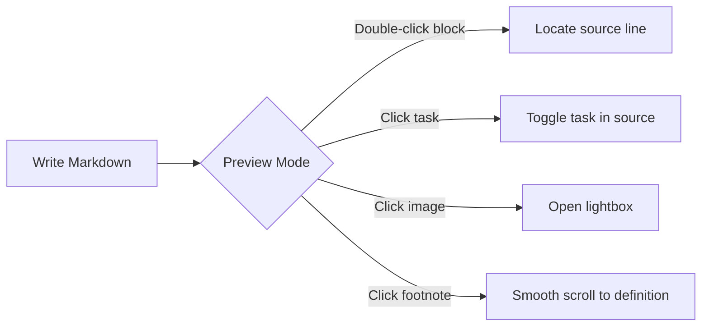
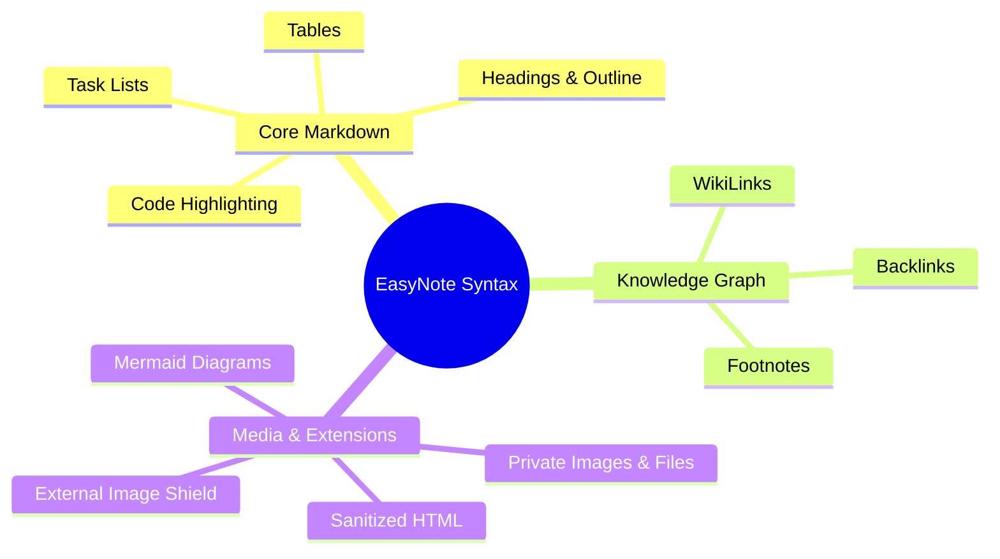

# EasyNote Markdown Rendering Syntax Showcase

This document demonstrates the complete set of Markdown syntax, formatting elements, diagrams, and security extensions supported by EasyNote.

## Text Styles & Formatting

Supports standard **Bold**, *Italic*, ~~Strikethrough~~, `Inline Code`, and automatic hyperlinks: https://example.com.

> This is a blockquote.
> Blockquotes support nested Markdown formatting.

---

## Task Lists

Task lists can be **clicked to toggle** directly in preview mode. The state is automatically synchronized back to the Markdown source. Uncompleted tasks across all notes are aggregated in the sidebar's "Task Center":

- [ ] Incomplete task item 1
- [x] Completed task item 2
- [ ] Task with link or formatting: Check out [EasyNote](https://github.com)

---

## GFM Tables

Supports standard GitHub Flavored Markdown tables with column alignments using colon syntax:

| Feature | Syntax Example | Alignment | Status |
| :--- | :---: | :---: | ---: |
| Task Lists | `- [ ] item` | Center | ✅ Fully Supported |
| Code Highlighting | ` ```ts ` | Center | ✅ Fully Supported |
| Knowledge Links | `[[uuid\|title]]` | Center | ✅ Fully Supported |
| External Image Shield | `` | Center | 🛡️ Privacy Protected |
| Statistics | 1,024 KB | Right | 🚀 Native Support |

---

## Code Blocks & Syntax Highlighting

Supports syntax highlighting for major programming languages via `highlight.js`. Double-clicking any code block navigates to its source line in the editor:

```typescript
// TypeScript Example
interface NoteItem {
  id: string;
  title: string;
  tags: string[];
  updatedAt: number;
}

export function formatNoteSummary(note: NoteItem): string {
  return `[${note.id}] ${note.title} (${note.tags.join(', ')})`;
}
```

```python
# Python Example
def fibonacci(n: int) -> list[int]:
    """Generate Fibonacci sequence"""
    a, b = 0, 1
    result = []
    for _ in range(n):
        result.append(a)
        a, b = b, a + b
    return result

print(fibonacci(5))  # [0, 1, 1, 2, 3]
```

```bash
# Bash Script Example
curl -X POST https://your-domain.com/api/notes \
  -H "Content-Type: application/json" \
  -d '{"title": "New Note", "content": "Hello World"}'
```

---

## Footnotes

Footnote references can be inserted in the text[^1], with multiple footnotes supported in the same paragraph[^2].
In preview mode, clicking the footnote superscript smoothly scrolls to the definition at the bottom; clicking the `↩︎` icon smoothly navigates back to the reference in the body text.

[^1]: Detailed definition and notes for the first footnote.
[^2]: Second footnote providing supplemental context.

---

## Knowledge Links (WikiLinks) & Backlinks

Use `[[Note-UUID|Display Title]]` or `[[Note-UUID]]` syntax to create bidirectional links between notes. Clicking a link in preview mode navigates directly to the target note in-app. The sidebar outline panel automatically aggregates backlinks pointing to the current note:

- Example link: [[00000000-0000-0000-0000-000000000001|Project Roadmap]]
- Example ID only: [[00000000-0000-0000-0000-000000000002]]

---

## Images & Attachments

### 1. Private Images
Uploading or pasting an image creates a secure internal link:
``
- **Features**: Lazy-loaded, backed by offline IndexedDB caching, and opens a full-screen lightbox preview on click in preview mode.

### 2. Private Attachments
Uploading PDF, TXT, CSV, or ZIP files creates a private download link:
`[Design Specification.pdf](/api/files/00000000-0000-0000-0000-000000000002)`
- **Features**: Triggers a secure browser download with the `download` attribute and `nosniff` header.

### 3. External Image Tracking Shield
To protect privacy and prevent third-party IP tracking, external HTTP(S) images are blocked by default and rendered with a placeholder:


---

## Mermaid Diagrams

Supports Flowcharts, Mindmaps, Sequence Diagrams, Class Diagrams, State Diagrams, Gantt charts, etc., automatically styled for light and dark modes:





---

## Sanitized HTML Blocks

Safe HTML elements sanitized by DOMPurify can be embedded directly in Markdown:

<section>
  <p>Supports <mark>highlighting (mark)</mark>, <kbd>Ctrl</kbd> + <kbd>E</kbd> keyboard hints, and expandable details:</p>
  <details open>
    <summary><strong>Click to expand / collapse details</strong></summary>
    <p>For security, EasyNote automatically strips <code>&lt;script&gt;</code>, <code>&lt;iframe&gt;</code>, <code>&lt;style&gt;</code>, form elements, and external media.</p>
  </details>
</section>
