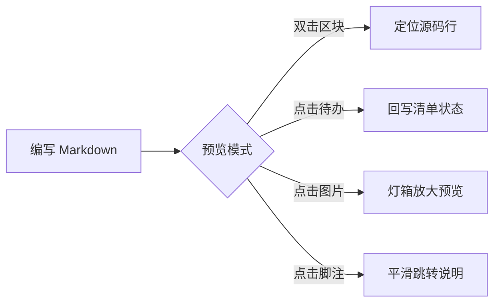
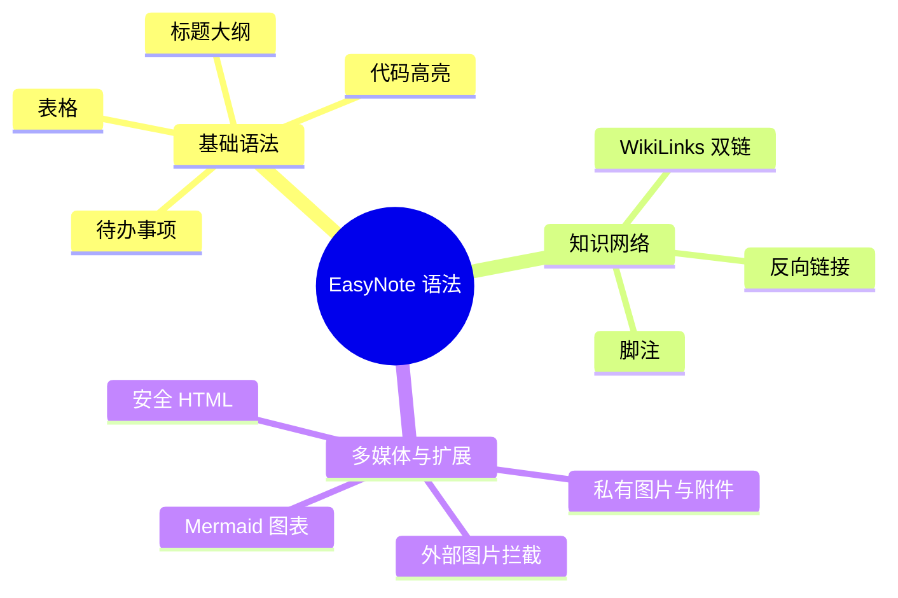

# EasyNote Markdown 渲染语法全功能演示

本文档演示 EasyNote 完整支持的 Markdown 语法、排版元素、图表与安全扩展。

## 文本样式与排版

支持常规 **粗体 (Bold)**、*斜体 (Italic)*、~~删除线 (Strikethrough)~~、`行内代码 (Inline Code)` 以及自动超链接：https://example.com 。

> 这是一段引用文本（Blockquote）。
> 引用内支持嵌套其他 Markdown 语法。

---

## 待办事项 (Task Lists)

待办事项在预览模式下可直接**点击勾选**，状态会自动同步回写至 Markdown 源码；全局未完成待办会自动聚合在侧栏的“任务中心”中：

- [ ] 未完成待办事项 1
- [x] 已完成待办事项 2
- [ ] 支持带有超链接或强调的待办事项：测试 [EasyNote](https://github.com)

---

## GFM 表格 (Tables)

支持标准 GitHub Flavored Markdown 表格，并支持冒号语法指定列对齐方式：

| 功能模块 | 语法示例 | 对齐方式 | 支持状态 |
| :--- | :---: | :---: | ---: |
| 待办清单 | `- [ ] 事项` | 居中对齐 | ✅ 完全支持 |
| 语法高亮 | ` ```ts ` | 居中对齐 | ✅ 完全支持 |
| 知识链接 | `[[uuid\|标题]]` | 居中对齐 | ✅ 完全支持 |
| 外部图片拦截 | `` | 居中对齐 | 🛡️ 隐私保护 |
| 数值统计 | 1,024 KB | 右对齐 | 🚀 原生支持 |

---

## 代码块与语法高亮 (Code Highlighting)

支持主流编程语言的语法高亮（基于 `highlight.js`），支持双击代码块切回源码行：

```typescript
// TypeScript 示例
interface NoteItem {
  id: string;
  title: string;
  tags: string[];
  updatedAt: number;
}

export function formatNoteSummary(note: NoteItem): string {
  return `[${note.id}] ${note.title} (${note.tags.join(', ')})`;
}
```

```python
# Python 示例
def fibonacci(n: int) -> list[int]:
    """生成斐波那契数列"""
    a, b = 0, 1
    result = []
    for _ in range(n):
        result.append(a)
        a, b = b, a + b
    return result

print(fibonacci(5))  # [0, 1, 1, 2, 3]
```

```bash
# Bash 脚本示例
curl -X POST https://your-domain.com/api/notes \
  -H "Content-Type: application/json" \
  -d '{"title": "新笔记", "content": "Hello World"}'
```

---

## 脚注 (Footnotes)

可以在正文中插入脚注引用[^1]，也可以在同一个段落中插入多个脚注[^2]。
在预览模式下，点击脚注角标可平滑滚动至文末的脚注说明处；点击文末说明后的 `↩︎` 符号可快速返回正文对应的引用位置。

[^1]: 这是第一个脚注的详细说明内容，支持多行或较长解释。
[^2]: 这是第二个脚注，用于补充辅助背景信息。

---

## 知识链接 (WikiLinks) 与双向链接

使用 `[[笔记UUID|显示标题]]` 或 `[[笔记UUID]]` 语法可在笔记之间建立双向链接。在预览模式下点击链接可直接在应用内打开目标笔记；侧栏大纲与反向链接面板会自动汇总当前笔记被哪些笔记所引用：

- 示例链接：[[00000000-0000-0000-0000-000000000001|项目开发计划]]
- 示例简写：[[00000000-0000-0000-0000-000000000002]]

---

## 图片与附件 (Images & Attachments)

### 1. 私有图片
应用内通过图片上传工具或直接粘贴图片，会自动生成私有图片链接：
``
- **特性**：支持按需懒加载、离线 IndexedDB 缓存兜底，在预览模式中点击图片可打开全屏灯箱放大预览。

### 2. 私有附件
上传 PDF、TXT、CSV、ZIP 等文件会生成私有附件下载链接：
`[项目设计说明书.pdf](/api/files/00000000-0000-0000-0000-000000000002)`
- **特性**：预览模式下点击会自动触发浏览器安全下载（强制附加 `download` 属性与 `nosniff` 防嗅探）。

### 3. 外部图片防追踪拦截
为保护用户隐私、防止第三方通过图片加载请求进行 IP 跟踪，外部 HTTP(S) 图片默认不被加载，并被渲染为占位提示：


---

## Mermaid 图表

支持流程图 (Flowchart)、思维导图 (Mindmap)、时序图 (Sequence)、类图 (Class)、状态图 (State)、甘特图 (Gantt) 等，自动适配系统暗黑模式：





---

## 安全 HTML 块 (Sanitized HTML)

在 Markdown 中可直接内嵌经过 DOMPurify 严格过滤的安全 HTML 结构标签：

<section>
  <p>支持使用 <mark>高亮标签 (mark)</mark>、<kbd>Ctrl</kbd> + <kbd>E</kbd> 快捷键提示，以及折叠详情面板：</p>
  <details open>
    <summary><strong>点此折叠 / 展开详细说明</strong></summary>
    <p>为了保障安全，EasyNote 会自动剥离 <code>&lt;script&gt;</code>、<code>&lt;iframe&gt;</code>、<code>&lt;style&gt;</code>、表单组件与外部流媒体等潜在风险标签。</p>
  </details>
</section>
