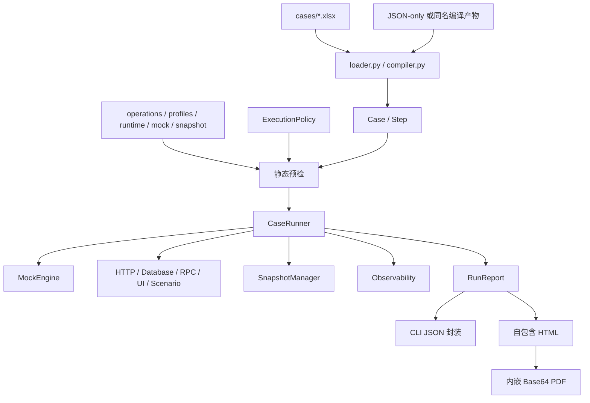

# EasyTest 0.2.0 全面代码与体验评审

## 0. 评审基线

| 项目 | 内容 |
| --- | --- |
| 评审日期 | 2026-09-28 |
| 版本 | EasyTest 0.2.0 |
| Git 基线 | `d6d6fd0c6e897606b9825acc3b9f4b90a87c03d5` |
| 本次运行环境 | Python 3.12.13 |
| 自动化验证 | `uv run pytest -q`：384 passed |
| 静态检查 | `uv run ruff check .`：通过 |

本次评审覆盖源码、测试、根 README、业务接入指南、AI 接入指南、安装包契约和
JSONPlaceholder 示例。未实际验证 Python 3.13、真实业务环境、pytest-xdist、
大规模数据性能、独立安全审计和发布安装包，因此相关结论只作为风险判断，不能视为
生产验收结果。

总体判断：EasyTest 已形成清晰的 XLSX 来源管理、严格预检、顺序执行、结构化结果
和离线报告闭环，适合继续做真实业务试点。当前优先级不应是继续扩展协议数量，而是
验证真实接入效果、收紧敏感信息边界，并补齐大响应保护和编辑后项目级校验。

## 1. 架构与执行链路

需要注意两条不同的来源路径：

- `run` 遇到 XLSX 时会生成或更新同名 JSON，再从编译产物加载。
- `list` 和 `validate` 使用 `write_compiled=False`，直接在内存解析 XLSX，不生成
  JSON、报告或快照。

机器 JSON 封装由 CLI 和报告层生成，不是 `CaseRunner` 自身的职责。

## 2. 已验证优势

### 2.1 来源一致性和结构化编辑

- XLSX 是人工维护来源，同名 JSON 提供可审查的确定性文本产物。
- 直接加载编译 JSON 时会核对 `source_sha256` 和 `compiler_version`，能够发现来源
  缺失、哈希不一致和编译版本变化。
- `easytest edit` 按 Case/Step ID 执行结构化修改，修改前后校验工作簿契约，并采用
  临时文件和原子替换降低半写入风险。

这些机制能够检测大部分来源不一致，但不能单独保证提交前一定执行了编译检查；
仓库仍应在 CI 中运行 `easytest compile cases --check`。

### 2.2 静态预检和执行门禁

- `validate` 不调用业务服务，也不导入业务 handler。
- Python handler 使用 `PathFinder`、AST 和符号表进行静态存在性检查，避免执行模块
  顶层代码。
- 整批用例预检通过后，`run` 才开始执行第一条业务步骤。
- 执行策略可以限制 Profile、Case、operation、executor 及 HTTP method/origin；
  环境变量指定的策略不能被命令行替换。

这里的“只读”应限定为“不写编译产物、报告或快照，不调用业务服务和 handler”。
预检仍会读取源码、配置、`.env` 和快照基线，并可能以只读方式打开 SQLite 基线。
执行策略属于可选的应用层门禁，不是网络或进程沙箱；获准的 handler 仍是受信任代码。

### 2.3 模型与运行上下文

[`Case`](src/easytest/models.py#L72-L88) 和
[`Step`](src/easytest/models.py#L58-L69) 使用 `frozen=True`，可以阻止字段被重新赋值。
这属于浅层冻结：`variables`、`request` 等嵌套字典仍然可变，不能描述为深度不可变。

[`RunContext`](src/easytest/models.py#L100-L120) 在每次 Case 执行时创建，
`step_outputs` 和 `state` 不直接存放在 `CaseRunner` 上，Case 间默认隔离。

### 2.4 报告和机器接口

- `list/validate/run/edit` 使用统一的
  `schema_version/command/status/data/errors/artifacts` 封装。
- `run --result` 通过原子替换写入与 stdout 同结构的 JSON。
- HTML 报告无外部 CDN，JSON 以转义后的文本嵌入，PDF 以 Base64 嵌入。
- 错误报告对框架错误、断言失败、快照差异和未知业务异常采用不同的安全输出策略。

`init` 和 `compile` 仍输出普通文本，不属于上述统一 JSON 协议。

### 2.5 工程规模

核心运行依赖保持在 8 个，数据库、浏览器认证、Notebook 和示例图像依赖按用途拆分。
源码具有较完整的类型标注，但当前没有 mypy/pyright 等静态类型检查门禁，也没有
覆盖率阈值，不能将“有类型标注”等同于“经过严格静态类型验证”。

## 3. 已确认风险与体验问题

| 优先级 | 问题 | 证据与影响 | 建议 |
| --- | --- | --- | --- |
| P0 | HTTP 大响应缺少读取上限 | [`HttpClient.request`](src/easytest/transport/http.py#L162-L195) 会调用 `response.json()` 或 `response.text`；即使 `stream=true` 也会读取完整响应。报告层截断发生得更晚，无法阻止执行阶段内存增长。 | 增加 `max_response_bytes`，按块读取并计算哈希；超过阈值时返回截断元数据或显式失败。文件下载应提供独立 artifact 路径。 |
| P0 | 敏感信息约束部分依赖使用规范 | RPC auth 和数据库密码有环境变量约束，但 HTTP 敏感 header 可以配置字面量。脱敏依赖已知键名和文本模式，无法保证识别任意业务字段。 | 对 `Authorization/Cookie/*token*/*secret*` 等敏感 HTTP 配置强制或默认要求环境变量引用；允许项目扩展 secret/PII 键集合，并在文档中避免“绝对隔离”表述。 |
| P0 | 缺少真实业务和独立 AI 验收 | 当前 384 项测试验证框架行为，但尚未证明旧业务迁移成本、真实鉴权、副作用清理、AI 首次接入和失败恢复体验。 | 选择一个小到中等真实项目试点，记录首次接入耗时、人工修正次数、预检命中率、真实/Mock 差异和失败后清理结果。 |
| P1 | `easytest edit` 只做工作簿契约校验 | [`edit_workbook`](src/easytest/cases/editor.py#L237-L297) 不加载项目配置，因此未知 operation 等问题要到后续 `validate` 才能发现。 | 明确文档边界；评估增加 `easytest edit --validate --root ...`，在替换前执行项目级预检，失败时保留原文件。 |
| P1 | CLI 缺少运行时 fail-fast 选项 | [`_run`](src/easytest/cli.py#L286-L308) 在普通 Case 失败后继续执行后续 Case。外部服务异常或鉴权失效时，后续写操作仍可能发生。 | 增加 `--fail-fast` 或 `--max-failures`，默认行为保持兼容；机器结果中标记未执行 Case。 |
| P1 | Excel 定位信息仍不完全一致 | JSON 单元格错误已有坐标，Step 契约错误已有 `steps` 行号，但 Case 级契约错误通常缺少 `cases` 行号。 | 补齐 Case 来源行号和列头；保持严格失败，不自动修复 Excel 类型，避免静默改变 ID、前导零或业务数据。 |
| P1 | 尚无声明式业务轮询 | 已有 [`poll()`](src/easytest/runtime/polling.py#L26-L73) 工具及单测，但没有接入 Step/XLSX 契约。异步任务仍需 handler。 | 复用现有轮询工具，通过独立 Step `polling` 字段接入，不要混入 HTTP request 参数。 |
| P2 | pytest-xdist 不聚合 EasyTest HTML | 插件检测到 worker 或 `-n` 后明确跳过报告写入，避免多个进程竞争同一文件。 | 仅在真实 CI 时长证明有价值后实现 worker 结果聚合。 |
| P2 | Runner 不保证并发安全 | `CaseRunner` 维护报告、预检许可、SnapshotManager 和 executor 生命周期状态。虽然 Case 的 `RunContext` 独立，同一个 Runner 仍不应跨线程共享。 | 保持“一 worker 一 Runner”；不要直接在线程间共享实例。 |
| P2 | 大表解析仍会积累内存 | 编译器已经使用 `load_workbook(..., read_only=True)`，但会将 cases/steps 全部转换为列表和模型。 | 先建立真实规模基准；只有内存或启动时间达到阈值后再考虑流式索引或分片。 |
| P2 | 数据库每步独立连接 | 每个数据库步骤独立连接、提交或回滚并关闭，隔离清晰，但大量短步骤会产生握手成本。 | 优先使用 `execute_many` 或业务 fixture；只有基准证明连接成本显著时，再设计明确生命周期的 Case 级复用。 |

## 4. 使用者体验判断

### 4.1 当前优势

1. Excel 面向业务维护，JSON 面向 Git diff、AI 分析和机器执行，职责清楚。
2. `offline-strict` 默认项目可以在无真实服务和无凭据时运行。
3. 严格字段、断言操作符和 operation 校验能够把拼写错误变成显式失败。
4. Notebook 支持独立 Case 和单 Step 调试、HTML 表格及截图展示。
5. 报告、CLI 结果和输入哈希便于 AI 或 CI 判断执行状态。

### 4.2 当前摩擦

1. `${variables.*}`、`${steps.*}` 和 `${state.*}` 只在当前 Case 生效。跨 Case 登录
   Token 需要由外部 fixture、预置环境变量或业务 adapter 管理。
2. 严格契约对新用户的错误反馈要求较高，尤其是 Excel 自动类型转换和 Case 行定位。
3. 尚无 OpenAPI/cURL/Postman 导入，存量接口首次录入成本较高。
4. 底层轮询工具未接入表格契约，异步业务需要写 handler。
5. `source_sha256` 可以检测不一致，但仍需要 CI 执行 `compile --check` 才能形成强制门禁。

不建议为了模拟 Postman 的全局变量而直接把可变全局状态加入 `RunContext.environment`。
这会模糊凭据来源、Case 隔离和并发语义。如果真实试点证明共享鉴权是高频需求，应优先
设计有生命周期、刷新规则和只读输出的 auth provider，并确保整批预检先于鉴权调用。

## 5. 评分

评分口径：

- 5：能力完整，边界明确，并有自动化与真实场景证据。
- 4：核心能力完整，存在已知但可控的边界。
- 3：可以使用，但关键工作流仍依赖业务自定义。
- 2：主要能力或可靠性不足。
- 1：尚不可用。

| 维度 | 评分 | 置信度 | 说明 |
| --- | ---: | --- | --- |
| 架构与可维护性 | 4.4 | 高 | 分层和契约清晰；嵌套模型可变，缺少静态类型门禁和覆盖率阈值。 |
| 安全与防御设计 | 4.2 | 中 | 预检、策略和脱敏较完整；策略可选，HTTP 凭据约束与任意业务字段脱敏并非绝对。 |
| 测试工程师上手体验 | 4.0 | 中 | 初始化和离线示例完善；迁移工具、Case 行定位和复杂鉴权仍有摩擦。 |
| 业务场景覆盖 | 4.1 | 中 | HTTP/数据库/RPC/UI/Scenario、Mock 和快照覆盖较广；声明式轮询未接入。 |
| AI 协同与自动化 | 4.5 | 中 | 结构化编辑、预检、确定性产物和机器结果较成熟；仍需无历史上下文和真实业务验收。 |

高并发性能压测不是 EasyTest 当前定位，不应因缺少压测引擎而扣分。pytest-xdist 属于
回归执行提速和报告聚合能力，应与性能测试区分。

## 6. 建议路线图

### P0：生产接入前

1. **完成真实业务试点**
   - 至少覆盖真实鉴权、读请求、受控写请求、Mock、失败清理和报告交付。
   - 使用无历史上下文的 AI 会话按现有指南独立完成一次接入。
   - 将发现的问题转化为可重复测试，而不是只保留人工结论。

2. **增加 HTTP 响应大小保护**
   - 配置全局默认上限，并允许 operation 在受控范围内覆盖。
   - 流式读取时限制内存，保留状态码、headers、大小、哈希和截断原因。
   - 明确 JSON 断言、快照和 artifact 下载在超限时的行为。

3. **收紧敏感信息契约**
   - 校验敏感 HTTP header 的值来源。
   - 支持项目级附加脱敏键。
   - 增加“未知字段携带凭据”和 URL/query 泄漏的回归用例。

4. **补齐编辑闭环和 Excel 诊断**
   - 明确 `edit` 与 `validate` 的职责。
   - 评估原子化的“编辑、项目级预检、提交”流程。
   - 为 Case 级错误补充 sheet、行号、列头、原始类型和期望类型。

### P1：高频业务能力

1. **声明式轮询**
   - 在 Step 增加独立 `polling` 字段，复用现有 `poll()`。
   - `until/reject` 沿用现有断言路径与操作符，不引入表达式执行。
   - 定义超时、最大次数、可重试异常、每次策略检查、Mock sequence、事件和报告语义。
   - 快照只处理最终成功输出；文档提示非幂等 operation 的重复调用风险。

2. **JSON Schema 和编辑器支持**
   - 为 Case 文档、配置、编辑补丁和执行策略提供版本化 Schema。
   - 用契约测试确保 Schema 与运行时解析器保持一致。

3. **受限 OpenAPI 导入**
   - 首版只支持 OpenAPI 3 JSON、HTTP operation 骨架和本地 `$ref`。
   - 明确定义 operation 命名、重复项、已有配置合并和覆盖策略。
   - 不自动生成看似有效的业务断言；示例 Case 默认禁用或要求人工确认。
   - Swagger 2、YAML、远程 `$ref`、Postman 和 cURL 后续按真实需求增加。

4. **CLI 失败控制**
   - 增加 `--fail-fast` 或 `--max-failures`。
   - 保持默认继续执行以兼容当前行为。
   - 在报告中区分 failed、not_run 和 interrupted。

### P2：有规模证据后

1. **pytest-xdist 报告聚合**
   - worker 将可序列化报告写入 `config.workeroutput`。
   - controller 在 `pytest_testnodedown` 收集并按稳定顺序合并。
   - 当前 `CaseReport` 没有 `as_dict()`；实现时使用明确的序列化函数或
     `dataclasses.asdict`，并覆盖 worker 崩溃、重复 ID 和部分结果。

2. **共享鉴权能力**
   - 仅在真实试点证明重复登录成本显著后实施。
   - 使用独立 auth provider 或 pytest session fixture，不修改
     `RunContext.environment`。
   - 定义缓存、刷新、失效、并发、策略校验、脱敏和清理规则。

3. **数据库连接复用**
   - 先记录连接耗时和步骤数量。
   - 若确有瓶颈，再提供显式 opt-in 的 Case 级连接生命周期。
   - 不默认支持跨步骤长事务，避免降低隔离性并放大失败回滚复杂度。

## 7. 验收标准

后续每项能力至少应具备：

1. 契约、预检、运行时和报告行为一致。
2. 成功、配置错误、运行失败、中断和资源清理场景测试。
3. CLI、pytest 和 Notebook 入口行为一致或明确记录差异。
4. 不通过放宽断言、隐藏错误或自动修改业务数据来提升“成功率”。
5. 文档使用仓库相对链接，并记录适用版本和验证命令。
6. Python 3.12、3.13 CI 矩阵通过；发布前验证 wheel 安装和离线 Demo。

## 8. 结论

EasyTest 0.2.0 的核心架构已经具备继续试点的条件。最有价值的下一步是验证真实业务
闭环并消除可导致内存失控、敏感信息误入配置以及编辑后延迟失败的风险。声明式轮询、
OpenAPI 导入和 xdist 聚合都有价值，但应依据试点数据依次实施，不宜先于生产接入
验证和现有安全边界收紧。
